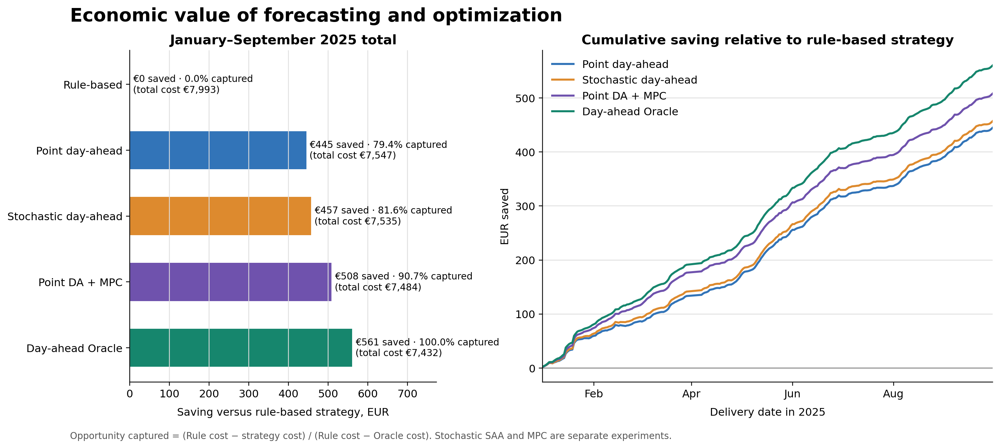
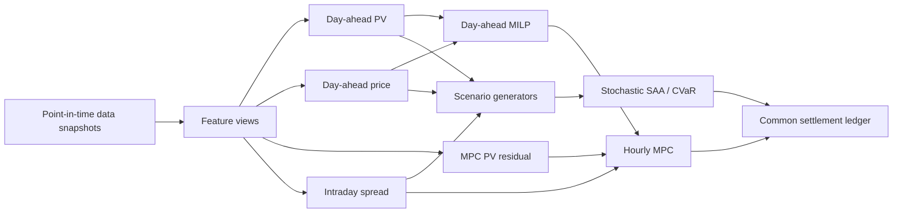

# Forecasting and Optimization for Industrial Energy Management

An end-to-end data science project for an industrial electricity consumer with
flexible production load, on-site photovoltaic generation, battery storage and
access to the German day-ahead and intraday markets.

The project connects point and probabilistic forecasts to mixed-integer
optimization, then evaluates every policy through the same out-of-sample 2025
economic replay. It is designed as a portfolio-grade reference implementation:
the market chronology, information boundaries, physical constraints and
settlement ledger are explicit and testable.

## Economic result

All model choices were developed on 2024 data and frozen before the 2025
evaluation. The final comparison contains 261 complete delivery days from
January through September 2025.

| Strategy | Realised cost | Saving vs rule-based | Rule-to-Oracle opportunity captured |
|---|---:|---:|---:|
| Rule-based | EUR 7,992.53 | -- | 0.0% |
| Point day-ahead | EUR 7,547.38 | EUR 445.15 | 79.4% |
| Stochastic day-ahead, residual-bootstrap SAA | EUR 7,535.12 | EUR 457.41 | 81.6% |
| Point day-ahead + MPC | **EUR 7,484.07** | **EUR 508.46** | **90.7%** |
| Day-ahead Oracle | EUR 7,431.97 | EUR 560.56 | 100.0% |



The Rule-based policy is a spreadsheet-level lower benchmark. The Oracle is a
non-deployable upper benchmark that allocates capacity using factual PV output
and factual day-ahead prices. It is prohibited from speculative intraday
trading. Stochastic day-ahead optimization and deterministic MPC are separate
experiments, so their gains must not be added.

These figures are evidence about the architecture and the relative value of
its components, not a commercial savings claim. The plant, battery and
industrial demand form a synthetic scenario around a measured PV profile, and
public intraday indices are used in place of executable order-book quotes.

## System outline



The physical reference case uses a 200 kWh flexible daily production target,
a 06:00--22:00 operating window, a 10 kWp PV proxy and a 44.16 kWh usable
battery. The optimizer models battery state of charge, charge/discharge
efficiency, degradation, curtailment, grid import tariffs, terminal value and
mutually exclusive operating modes.

## Methods implemented

- **Point forecasts:** CatBoost, persistence and autoregressive baselines,
  direct residual correction and experimental MIMO MLP/LSTM trajectories.
- **Uncertainty:** whole-day residual bootstrap, multi-quantile regression,
  empirical copulas, conformal calibration and a circular seasonal kernel.
- **Decision making:** deterministic MILP, receding-horizon MPC, sample average
  approximation and mean-CVaR stochastic optimization.
- **Evaluation:** frozen 2024-to-2025 forecasting tests, a common physical and
  financial ledger, rule-based and Oracle bounds, paired block-bootstrap
  confidence intervals and error analysis.
- **Model lifecycle:** packaged training applications and optional MLflow
  tracking/Model Registry registration for the deployable forecasting models.

## Repository layout

```text
config/             versioned model and data configuration
data/metadata/      small provenance and quality manifests
docs/               report, architecture and current experiment documentation
scripts/            data collection and audit entry points
src/energy/data/    point-in-time data contracts and dataset builders
src/energy/training forecast training and frozen evaluation applications
src/energy/uncertainty/ probabilistic scenario generators
src/energy/optimization/ physical, market and settlement models
tests/              unit and contract tests
```

Downloaded data, materialized features, model artifacts, MLflow state and
notebook scratch output are intentionally excluded from Git. The pre-cleanup
research tree is retained in the `archive/research-snapshot` branch.

## Quick start

Python 3.11 or newer is required.

```bash
python -m venv .venv
source .venv/bin/activate
python -m pip install --upgrade pip
python -m pip install -e '.[dev,train]'
pytest -q
```

Build one leakage-safe annual training snapshot from locally collected source
tables:

```bash
energy build-training-data --project-root . --year 2024
```

Train and optionally register the deployable PV model:

```bash
energy train-pv-day-ahead \
  --project-root . \
  --year 2024 \
  --tracking-uri http://127.0.0.1:5000
```

Run the final deterministic economic replay:

```bash
energy run-dynamic-charge-economic-backtest \
  --project-root . \
  --start 2025-01-01 \
  --end 2025-09-30
```

The full probabilistic experiments are deliberately separate because they
consume precomputed forecast artifacts and solve hundreds of scenarios per
delivery day. Their exact commands and frozen inputs are recorded in the
linked experiment documents below.

## Data contract

The main sources are KIT MPVBench PV measurements, ERA5 reanalysis, archived
ICON and ECMWF IFS weather forecasts, DE-LU day-ahead auction prices and public
hourly intraday continuous-price indices. Every feature row records the target
time and the time at which its source became available. Offline builders enforce
`available_at <= as_of` to mirror the future online path.

The exact PV site coordinate and source timestamp convention are not published.
The project therefore uses an approximate Pforzheim weather coordinate and an
explicit `Europe/Berlin` timestamp assumption. Read the data quality report
before replacing or extending any source.

## Current scope of MLOps

The repository contains reusable training applications, MLflow configuration,
registry hooks, deterministic experiment artifacts and a tested Python CLI.
ClearML orchestration, the online API, containers, deployment manifests and
production monitoring are architectural targets; they are not presented as
already deployed components.

## Documentation

- Project report: [Markdown](docs/project_report.md) and
  [PDF](docs/project_report.pdf) — business setting, mathematical formulation,
  modelling experiments and economic conclusions.
- [Design document](docs/design_document.md) — detailed requirements and
  modelling decisions developed during the project.
- [Technical architecture](docs/architecture.md) — intended modular-monolith,
  orchestration and model-registry design.
- [Final deterministic formulation](docs/economic_backtest_v4_final_formulation.md)
  — final battery, tariff, curtailment, Oracle and MPC semantics.
- [Frozen temporal backtest](docs/temporal_backtest_2025.md) — forecasting
  evaluation contract for 2024 training and 2025 testing.
- [Quantile scenarios](docs/quantile_spread_copula_experiment.md) and
  [residual-bootstrap economics](docs/residual_bootstrap_spread_economic_backtest_v3.md)
  — probabilistic forecasting and stochastic optimization.
- [Documentation index](docs/index.md) — the remaining current technical notes.

## Reproducibility boundary

The small JSON manifests under `data/metadata` are versioned. Large public
downloads and generated Parquet/CSV files are local by design and can be
reconstructed with the collection and build commands. Final report figures are
versioned under `docs/assets/report`; complete run outputs remain under the
ignored local `artifacts/` directory.
