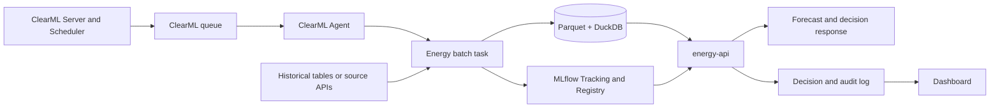

# Техническая архитектура Energy Optimization

> **Статус:** рабочий черновик для первой реализации. Документ уточняет границы модулей, хранение данных и схему запуска. Он не меняет математическую постановку из `design_document_draft.md`.

## 1. Основное архитектурное решение

Проект реализуется как **модульный монолит**: один Python-пакет, один набор доменных контрактов и один Docker image. Четыре прогнозные модели являются отдельными модельными артефактами и Python-компонентами внутри общего `ForecastingService`, а не отдельными сетевыми микросервисами.

Логических компонентов в приложении несколько. В первой версии используются следующие deployment units:

1. `energy-api` — синхронный расчёт прогнозов и решений;
2. `clearml-agent` — выполнение ingestion, backfill, feature, training и backtest tasks из очереди ClearML;
3. `mlflow-server` — experiment tracking, модельные артефакты и Model Registry;
4. dashboard — добавляется после рабочего end-to-end бэктеста.

Прикладной код API и batch-задач собирается в один `energy` image. ClearML отвечает за orchestration, расписание, очереди и состояние pipeline runs. MLflow является единственным источником истины для жизненного цикла обученных моделей: training runs, версии, теги, aliases и promotion.

Такой вариант сохраняет чистые границы кода и production-like запуск без сетевого взаимодействия между четырьмя небольшими моделями.

## 2. Почему модели не разделяются на микросервисы

В проекте четыре прогнозных задачи:

1. day-ahead PV;
2. day-ahead price;
3. MPC PV;
4. intraday price.

У них разные признаки, горизонты и модельные артефакты, поэтому они остаются отдельными estimators. При этом они:

- используют один временной индекс и общие исторические данные;
- запускаются в одном workflow;
- имеют небольшую вычислительную нагрузку;
- меняются одной командой проекта;
- не требуют независимого масштабирования или разных SLA.

Выделение каждого estimator в Docker-сервис добавило бы API-контракты, сетевые ошибки, service discovery, версионирование нескольких images и сложный локальный запуск, но не добавило бы полезной функциональности. Граница микросервиса понадобится только при независимом масштабировании, отдельной команде-владельце или существенно разных runtime-зависимостях.

## 3. Слои данных

Существующие каталоги сохраняются и дополняются:

```text
data/
  raw/          # неизменяемые ответы источников
  processed/    # нормализованные таблицы одного домена
  curated/      # согласованные point-in-time таблицы и общий временной индекс
  features/     # отдельные feature views для прогнозных задач
  artifacts/    # локальные отчёты и промежуточные артефакты; модели хранятся через MLflow
  metadata/     # manifest, data quality и версии схем
```

Основной формат персистентных таблиц — Parquet. Для локальных выборок, joins и проверки снимков используется DuckDB. Отдельный сервер базы данных для V1 не нужен.

### 3.1. Временные поля

Каждая нормализованная запись должна различать:

| Поле | Смысл |
|---|---|
| `valid_time_utc` | период, к которому относится значение |
| `available_at_utc` | момент, когда значение разрешено использовать системе |
| `issued_at_utc` | время выпуска прогноза, если оно применимо |
| `ingested_at_utc` | время загрузки в наше хранилище |
| `source` | поставщик и набор данных |
| `quality_status` | результат проверки записи |

`available_at_utc` является основной защитой от временной утечки. Исторический провайдер возвращает только строки, для которых

$$
\mathrm{available\_at\_utc} \le \mathrm{as\_of\_utc}.
$$

Внутренний технический индекс хранится в UTC. Границы рыночного дня и производственного окна вычисляются в `Europe/Berlin` с явной обработкой перехода на летнее время.

## 4. Интерфейс источника данных

Модели и оптимизатор не читают CSV или Parquet напрямую. Они получают типизированные снимки через один фасад:

```python
class DataProvider(Protocol):
    def get_day_ahead_context(
        self,
        as_of: datetime,
        delivery_day: date,
    ) -> DayAheadContext: ...

    def get_mpc_context(
        self,
        as_of: datetime,
        horizon_end: datetime,
    ) -> MpcContext: ...

    def get_realized_interval(
        self,
        start: datetime,
        end: datetime,
    ) -> RealizedData: ...
```

Первая реализация — `HistoricalDataProvider`. Она читает локальные Parquet/DuckDB-таблицы и симулирует состояние внешних сервисов на исторический момент времени.

Позже добавляются адаптеры реальных источников:

- `WeatherApiAdapter`;
- `DayAheadMarketApiAdapter`;
- `IntradayMarketApiAdapter`;
- `TelemetryApiAdapter`.

Они реализуют те же входные контракты. Из-за этого прогнозы, оптимизатор и API приложения не знают, пришли данные из исторической таблицы или реального endpoint.

### 4.1. Day-ahead снимок

`DayAheadContext` содержит:

- точное `as_of` до закрытия аукциона;
- 24 часа поставки следующего рыночного дня;
- доступный на `as_of` прогноз погоды;
- историю PV, day-ahead цен и погоды только до `as_of`;
- календарные поля и идентификатор версии данных.

Сервис возвращает 24 периода поставки. Дополнительный технический час может запрашиваться у внешнего погодного источника, но не должен менять контракт выходного day-ahead плана.

### 4.2. MPC-снимок

`MpcContext` содержит:

- `as_of` после последнего завершённого часа;
- все оставшиеся часы до конца операционного дня;
- фактические PV и intraday-цены только до `as_of`;
- оставшийся производственный объём;
- текущий SoC и доступную энергию батареи;
- зафиксированные $q_h^{DA}$ и $P_h^{DA}$;
- доступные обновлённые внешние прогнозы.

Горизонт задаётся параметром `horizon_end`, а не константой «10 часов». Если производственное окно действительно равно десяти часам, первый утренний вызов вернёт десять часов, а каждый следующий — весь сократившийся остаток.

## 5. Offline backfill и online simulation

У pipeline есть два режима, использующие одинаковые преобразования.

### 5.1. Online path

Один вызов строит снимок на конкретный `as_of`, вычисляет признаки, запускает прогнозы и возвращает решение. Именно этот путь позже обслуживает API.

### 5.2. Offline path

Batch-команда проходит по историческим decision times и материализует обучающие выборки. Она не должна читать будущие значения через wide join. Для каждой строки применяется то же правило `available_at <= as_of`, что и в online path.

Исторические данные за 2024–2025 годы материализуются полностью, а роль периода определяется конфигурацией эксперимента. Базовый честный вариант:

- 2024 год — первоначальное обучение и настройка;
- 2025 год — walk-forward бэктест;
- при расширяющемся окне ранние дни 2025 года могут входить в обучение только для более поздних дней.

## 6. Feature pipeline

Канонический слой данных общий, но одна широкая обучающая таблица для всех моделей не создаётся. Вместо неё строятся четыре feature views:

```text
features/da_pv/
features/da_price/
features/mpc_pv/
features/intraday_price/
```

Это необходимо из-за разных `as_of`, горизонтов, target и доступных лагов. Общие преобразования — календарь, локальное время, солнечная геометрия, lag/rolling utilities — переиспользуются как функции.

Каждая строка feature view содержит как минимум:

- `as_of_utc`;
- `valid_time_utc`;
- `horizon_hours`;
- признаки;
- target, если факт уже раскрыт для offline dataset;
- `feature_version`;
- `data_snapshot_id`.

## 7. Прогнозный слой и Model Registry

`ForecastingService` загружает четыре независимо версионируемых модели из MLflow Model Registry:

```text
energy-da-pv
energy-da-price
energy-mpc-pv
energy-intraday-price
```

Для каждого registered model используются aliases:

- `candidate` — новая версия, прошедшая обучение и базовую техническую проверку;
- `champion` — версия, разрешённая для day-ahead или MPC decision path.

После обучения модель логируется в MLflow вместе с параметрами, метриками, сигнатурой входа/выхода, примером входных данных, `feature_version` и `data_snapshot_id`. Затем создаётся новая registered model version. Текущие реализованные PV training app (`energy train-pv-day-ahead` и `energy train-pv-mpc-residual`) делают именно этот шаг по явному флагу `--register`; они не назначают alias автоматически. Residual app явно требует вход `day_ahead_prediction_w`, то есть сохранённый day-ahead PV-прогноз совместимой head-модели. Это сохраняет регистрацию новой версии отделённой от решения о её использовании.

После появления хронологического backtest и decision-oriented evaluation добавляется целевой lifecycle: evaluation step назначает новой версии alias `candidate`, сравнивает её с текущим champion на одном временном срезе и при прохождении заданных критериев атомарно переносит alias `champion`. Rollback выполняется возвратом alias на предыдущую версию. Рабочая инструкция и переменные подключения находятся в `docs/pv_training_and_mlflow.md` и `config/mlflow.env.example`.

Online-сервис обращается к моделям по стабильным URI:

```text
models:/energy-da-pv@champion
models:/energy-da-price@champion
models:/energy-mpc-pv@champion
models:/energy-intraday-price@champion
```

ClearML может отображать метрики исполняемой training task, но MLflow остаётся источником истины для модельных экспериментов и registry. Это исключает две конкурирующие процедуры promotion.

У моделей общий выходной контракт:

```python
class ForecastFrame:
    as_of: datetime
    target_times: list[datetime]
    point: list[float]
    quantiles: dict[float, list[float]] | None
    scenarios: list[list[float]] | None
    model_version: str
    feature_version: str
    data_snapshot_id: str
```

В V1 заполняется `point`. В стохастическом расширении добавляются quantiles и scenarios без изменения API оптимизатора и журнала решений.

## 8. Decision workflows

### 8.1. Day-ahead

```text
DayAheadContext
  -> day-ahead feature views
  -> PV forecast + price forecast
  -> optional scenario generator
  -> day-ahead optimizer
  -> q_DA + initial load/battery plan
  -> decision log
```

### 8.2. MPC

```text
MpcContext
  -> MPC feature views
  -> remaining PV forecast + intraday price forecast
  -> optional scenario generator
  -> optimization of the full remaining horizon
  -> execute/commit the nearest action
  -> decision log
```

## 9. Логические модули Python-пакета

```text
src/energy/
  config/
  domain/              # временные интервалы, состояния и решения
  data/
    contracts.py
    providers/
      historical.py
      weather_api.py
      market_api.py
      telemetry_api.py
    repository.py
    quality.py
  features/
    common.py
    day_ahead_pv.py
    day_ahead_price.py
    mpc_pv.py
    intraday_price.py
  forecasting/
    service.py
    mlflow_registry.py
    trainers/
  orchestration/
    clearml/
      data_pipeline.py
      training_pipeline.py
      backtest_pipeline.py
      schedules.py
  tracking/
    mlflow.py
  scenarios/
  optimization/
    day_ahead.py
    mpc.py
  simulation/
    clock.py
    backtest.py
    ledger.py
  application/
    day_ahead_workflow.py
    mpc_workflow.py
  api/
    main.py
  cli.py
```

Эти каталоги являются границами модулей, а не отдельными сервисами.

## 10. API и команды

HTTP API нужен для демонстрации decision path, но ingestion, обучение и backfill удобнее запускать как batch-команды.

Предлагаемые HTTP endpoints:

```text
POST /v1/decisions/day-ahead
POST /v1/decisions/mpc
GET  /v1/runs/{run_id}
GET  /health
```

Предлагаемые CLI-команды:

```text
energy data ingest
energy data backfill
energy features build
energy train
energy backtest run
energy serve
```

Отдельные HTTP endpoints для каждой из четырёх моделей в V1 не нужны. Решение пользователя состоит из согласованного набора прогнозов и оптимизации, поэтому наружу публикуется workflow, а не внутренняя структура model calls.

## 11. Deployment V1



Прикладной Docker image запускается в разных режимах:

```text
energy-api:  energy serve
batch task:  energy <command>
```

Для локальной разработки `docker compose` поднимает `energy-api`, `clearml-agent` и `mlflow-server`. ClearML Server может быть hosted или self-hosted. MLflow V1 использует SQLite как database-backed metadata store и локальный artifact volume; при росте параллелизма backend можно заменить на PostgreSQL, а artifacts — на object storage без изменения клиентского кода.

ClearML pipeline содержит крупные воспроизводимые шаги, а не отдельную task на каждый вызов модели. Операционные запуски `run_day_ahead_decision` и `run_mpc_decision` выполняют feature generation, загрузку champion-моделей и оптимизацию внутри одного процесса.

## 12. Первый инкремент реализации

Первый инкремент не обучает модели. Он доказывает корректность времени и контрактов данных:

1. создать Python package и конфигурацию проекта;
2. определить `DayAheadContext`, `MpcContext` и временные схемы;
3. нормализовать существующие processed-таблицы в Parquet с `valid_time_utc` и `available_at_utc`;
4. реализовать `HistoricalDataProvider`;
5. реализовать day-ahead snapshot и MPC snapshot;
6. проверить тестами, что будущий факт никогда не попадает в снимок;
7. материализовать небольшую выборку decision times и проверить её вручную;
8. после этого построить четыре feature views для 2024–2025 годов.

Первая обученная PV-модель уже имеет MLflow training app: она логирует run и по явному флагу создаёт registered model version. Автоматические aliases `candidate` и `champion` включаются после реализации временного holdout и decision-oriented evaluation.

Для intraday-контура теперь подключен и проверен отдельный публичный исторический ряд: Energy-Charts `Intraday Continuous Average Price (DE-LU)`. Он даёт почасовой realised delivery-period индекс и используется как консервативный settlement proxy, но не как исполнимая котировка. Поэтому следующий инкремент MPC-бэктеста может честно рассчитывать экономический результат по этому индексу; моделирование заявок, order book и времени закрытия торгов остаётся задачей V2.
