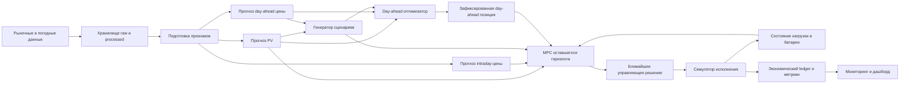

# Дизайн проекта: оптимизация энергопотребления с PV и батареей

> **Статус:** рабочий черновик. Документ фиксирует согласованную на текущий момент рамку проекта. Разделы будут уточняться по очереди; пункты со статусом «открыт» пока не являются окончательными решениями.

## 1. Цель проекта

Построить воспроизводимую систему управления энергией условного промышленного потребителя в Германии. У потребителя есть солнечная генерация, стационарная батарея, частично управляемая нагрузка и доступ к рынку электроэнергии.

Система должна:

1. прогнозировать генерацию PV и цены электроэнергии;
2. до начала суток формировать план покупки или продажи электроэнергии;
3. во время исполнения регулярно пересчитывать план с учётом факта и новых прогнозов;
4. минимизировать полную стоимость энергии, включая стоимость использования батареи;
5. быть оформлена как сквозной DS/MLOps-проект: данные, модели, оптимизация, исторический бэктест, мониторинг и демонстрационный интерфейс.

Проект нужен одновременно как практическая работа по forecasting/optimization/MLOps и как понятный портфолио-кейс. За несколько минут должно быть возможно увидеть задачу, архитектуру, качество прогнозов, экономический эффект и пример принятого решения.

## 2. Бизнес-логика и рыночный таймлайн

### 2.1. Участник рынка

Моделируется небольшой price-taking потребитель или агрегатор в зоне DE-LU. Он не влияет на рыночную цену и может:

- покупать энергию из сети;
- продавать излишки PV или энергию, выданную батареей;
- переносить часть потребления внутри суток;
- заряжать и разряжать стационарную батарею.

### 2.2. Day-ahead контур

**Цель контура.** До начала суток поставки $D$ определить почасовой план нетто-покупки или продажи энергии на рынке day-ahead. План должен обеспечить суточную производственную потребность, использовать доступную PV-генерацию и распределить ограниченный дневной запас энергии батареи в наиболее ценные часы.

**Момент решения.** В день $D-1$, до закрытия day-ahead аукциона, система строит план на все часы следующих суток $D$. После аукциона цена и принятый объём известны; в детерминированной V1 они далее не пересчитываются.

**Информация на момент решения.** Система использует только то, что доступно до аукциона:

| Величина | Обозначение | Роль в планировании |
|---|---|---|
| прогноз PV-генерации | $G_h$ | уменьшает ожидаемую потребность в покупке из сети |
| прогноз day-ahead цены | $P_h^{DA}$ | показывает относительную ценность потребления и разряда батареи по часам |
| суточный производственный план | $\sum_h L_h = 200\ \mathrm{kWh}$ | фиксирует объём работы, который должен быть выполнен за сутки |
| допустимый профиль производства | $L_h^{\min}, L_h^{\max}$ | ограничивает перенос гибкой нагрузки между часами |
| состояние и параметры батареи | $E_0,E_{\max},C_{\max},D_{\max},\eta_c,\eta_d$ | задают начальный SoC, ёмкость, мощность и потери |
| ночной ценовой ориентир и деградация | $\bar P_{\mathrm{night},14}, c_{\mathrm{deg}}$ | задают терминальную стоимость недостающего к концу дня заряда |

Здесь $h$ — час суток. В V1 $G_h$ и $P_h^{DA}$ являются точечными прогнозами. Их вероятностные сценарии относятся к стохастическому расширению.

**Решения оптимизатора.** На выходе планирования получаются:

- $L_h$ — сколько энергии потребит производство в час $h$;
- $C_h,D_h,E_h$ — заряд, разряд и состояние батареи;
- $U_h$ — управляемое ограничение PV-генерации (*curtailment*);
- $q_h^{DA}$ — нетто-позиция на рынке в час $h$.

Позиция выводится из прогнозного энергетического баланса:

$$
q_h^{DA} = L_h + C_h - G_h + U_h - D_h.
$$

Если $q_h^{DA}>0$, объект планирует купить энергию; если $q_h^{DA}<0$, он планирует продать избыток PV или энергии батареи. Это коммерческая позиция балансирующей группы, а не физический маршрут энергии к конкретному объекту.

**Почему нужен прогноз цены.** Мы не прогнозируем цену, чтобы выставить собственный price cap. Прогноз нужен, чтобы выбрать выгодные $L_h,C_h,D_h$: перенести гибкую часть производства в дешёвые часы, зарядить батарею из дешёвой сети или избытка PV и разрядить её в ценные часы.

**Правило подачи заявки.** В реальном DE-LU day-ahead аукционе простая заявка может быть price-inelastic: участник указывает объём на каждый период и принимает цену, которую определит аукцион. Такую заявку и моделирует V1. Мы предполагаем, что заявленный объём принимается полностью; не моделируем личный price cap, кривую «цена–объём», блоковые заявки и частичное исполнение.

Небольшой физический потребитель обычно не торгует на EPEX SPOT самостоятельно — его позицию подаёт поставщик или балансирующий ответственный. В проекте эта торговая функция представлена агрегатором.

**Граница упрощения V1.** Расчёт ведётся с часовым шагом: исходные quarter-hourly значения агрегируются до часа. Day-ahead задача формирует первоначальную позицию, а детерминированный MPC в течение суток оценивает её почасовые отклонения по отдельной intraday-цене. Реальные механизмы подачи intraday-заявок, bid-ask spread и отдельный imbalance settlement пока заменяются единым прозрачным правилом расчёта отклонений, описанным в разделе 6.4.

В текущей постановке day-ahead оптимизатор явно выбирает заряд и разряд. Жёсткого условия «заряжать только при неположительной цене» нет: решение учитывает рыночную цену, физический сетевой тариф, альтернативу экспорта PV и терминальную стоимость оставшегося заряда. Одновременный заряд и разряд запрещены бинарным режимом.

### 2.3. Контур исполнения

В течение суток фактическая PV-генерация отличается от прогноза, а уже выполненная производственная работа и фактический SoC меняют доступные ресурсы. После завершения часа $\tau$ система наблюдает факт до $\tau$, обновляет прогнозы и заново оптимизирует **весь оставшийся горизонт** $\tau+1,\ldots,T$.

Полученный профиль для оставшихся часов является новым планом. Необратимым становится только ближайшее решение для часа $\tau+1$: производственная нагрузка и соответствующая ожидаемая корректировка относительно day-ahead позиции. После следующего часа открывается новый факт, и весь ещё не исполненный хвост рассчитывается заново. Это MPC — *Model Predictive Control*, или управление с прогнозным скользящим горизонтом.

После аукциона фиксируются только day-ahead позиция $q_h^{DA}$ и рассчитанная
рынком цена $P_h^{DA}$. MPC заново оптимизирует оставшуюся нагрузку, заряд,
разряд, SoC и curtailment. Изменение day-ahead физического плана допустимо:
его финансовое следствие учитывается как отклонение от неизменной позиции
$q_h^{DA}$ по intraday-цене.

### 2.4. Горизонт планирования

Горизонт day-ahead прогноза и планирования — 24 часа поставки. Для технического сдвига между запуском расчёта и подачей заявки система запрашивает покрытие ещё на один час; полный горизонт входного прогноза составляет 25 часов. Второй день не добавляется: связь с последующей ночью задаётся терминальной стоимостью недостающего заряда.

## 3. Модельный сеттинг и предположения

### 3.1. Солнечная генерация

Используется реальный 15-минутный профиль мини-PV из MPVBench, агрегированный до часа для расчётов. Рабочая временная конвенция исходного ряда — `Europe/Berlin (provisional)`; она проверена по сопоставлению солнечного профиля с погодой, но не подтверждена метаданными первоисточника.

Точка погоды — приближённая точка в районе Pforzheim. Реальные координаты установки не известны, поэтому это осознанное допущение модели.

PV-генерация является внешней неопределённостью. Оптимизатор может направить
её в нагрузку, батарею или экспорт, а при невыгодном избытке ограничить выпуск.
Curtailment моделируется явно и не имеет отдельного штрафа, поэтому его цена —
только упущенная возможность использовать или продать соответствующую энергию.

### 3.2. Потребление и производственный цикл

Профиль нагрузки — модельный. Он представляет условный производственный процесс, который обязан потребить заданную энергию за сутки, но может переносить часть работы между часами.

Базовая постановка:

- суточный энергетический план: например, **200 kWh в сутки**;
- минимальная обязательная нагрузка `L_min[h]`;
- максимальная доступная мощность `L_max[h]`;
- гибкая часть нагрузки распределяется оптимизатором по часам;
- при необходимости добавляются рабочее окно, ограничения скорости изменения нагрузки и требования производства.

В первой версии не требуется создавать физически достоверную модель конкретного станка. Важнее, чтобы ограничения гибкой нагрузки были прозрачны, реалистичны и влияли на экономический результат.

### 3.3. Батарея

Батарея описывается параметрической физической моделью:

- полезная ёмкость $C_{\mathrm{bat}}$ [kWh];
- минимальный и максимальный SoC;
- максимальная мощность заряда и разряда [kW];
- КПД заряда и разряда;
- начальный SoC;
- запрет одновременного заряда и разряда.

Использование батареи не бесплатно. В модель включается стоимость деградации как стоимость пропущенной через батарею энергии:

$$
c_{\mathrm{deg}} =
\frac{\mathrm{replacement\_cost}}
{\mathrm{cycle\_life} \times \mathrm{usable\_capacity}}
\qquad [\mathrm{EUR/kWh}].
$$

Она входит в целевую функцию вместе со стоимостью покупки и доходом от продажи. Благодаря этому система не будет совершать циклы ради незначительной ценовой разницы.

Для первой версии деградация считается линейно по throughput. Динамика State of Health, снижение ёмкости и разные режимы старения относятся к последующему расширению.

### 3.4. Сеть и расчёт баланса

Для каждого часа выполняется энергетический баланс:

$$
\mathrm{PV} + \mathrm{import} + \mathrm{discharge}
= \mathrm{load} + \mathrm{charge} + \mathrm{export}.
$$

Возможность экспорта, его цена, одновременные импорт и экспорт и расчёт отклонений от day-ahead позиции должны быть заданы явно в разделе оптимизационной постановки.

### 3.5. Зафиксированная учебная установка V1

Чтобы экономическое сравнение было воспроизводимым, V1 использует один
фиксированный модельный объект. Это не попытка восстановить характеристики
реального владельца MPVBench-профиля: реальна форма PV-ряда, а размер установки,
нагрузка и батарея задаются явно.

| Компонент | Параметр V1 | Обоснование |
|---|---:|---|
| Производственная потребность | 200 kWh/сутки | постоянный объём работы, который должен быть выполнен за сутки |
| Рабочее окно | 06:00–22:00 Europe/Berlin | 16 почасовых периодов; вне окна производственная нагрузка равна нулю |
| Границы нагрузки внутри окна | $L_h^{min}=5$, $L_h^{max}=20$ kWh/ч | минимум за окно — 80 kWh, поэтому 120 kWh остаются переносимой частью; суточный план 200 kWh выполним |
| PV | 10 kWp, 20 модулей по 500 Wp | MPVBench profile `1a` сохраняет форму факта; его мощность масштабируется с приблизительных 0.5 kW до референсных 10 kWp фиксированным множителем 20 |
| Батарея | две BYD Battery-Box Premium HVM 22.1, 44.16 kWh usable суммарно | две референсные модульные LFP-батареи по 22.08 kWh; паспорт одной HVM 22.1 доступен в [документации производителя](https://bydbatterybox.com/uploads/downloads/BBOX_HVM_Datasheet_EN_V1.0_240703_L-668f8e06c4476.pdf) |
| Начальный доступный запас | 44.16 kWh | батарея считается полной к началу рабочего окна; её дневной график является решением day-ahead |
| Ограничение выдачи в сеть/нагрузку | 5 kWh за час | отдельное консервативное ограничение AC-инвертора/присоединения, а не паспортный предел самой батареи |
| КПД | $\eta_{ch}=\eta_{dis}=0.98$ | совокупно $0.98^2\approx96\%$, согласуется с заявленным round-trip efficiency референсной батареи |
| Деградация | 0.05 EUR на отданный kWh | сценарное приближение: 300 EUR/kWh replacement cost и 6 000 эквивалентных полных циклов |
| Ночная цена для терминальной стоимости | скользящее среднее последних 14 завершённых ночей; каждая ночь — среднее по меткам 22:00, 23:00 и 00:00–06:00, предварительно ограниченное снизу нулём | девять блоков по 5 kWh соответствуют 45 kWh ночной закупки; 14-дневное окно сглаживает случайные ночные выбросы и использует только известные к моменту решения цены |

Для всех стратегий масштаб PV, физические границы нагрузки, батарея и правило
ночной стоимости одинаковы. Поэтому сравнение измеряет качество решений, а не
выигрыш от изменения объекта между экспериментами.

## 4. Данные и доступная информация

Данные хранятся в каталоге проекта `data/` и разделены на raw, processed и metadata. Полный словарь и проверки качества находятся в `docs/`.

### 4.1. Факт

| Домен | Набор | Назначение |
|---|---|---|
| PV | MPVBench, 15 минут, 2024–2025 | целевая переменная для прогноза PV и факт исполнения |
| Погода | ERA5 / Open-Meteo, почасовой факт | признаки, анализ ошибок прогноза, валидация |
| Day-ahead цены | Energy-Charts, DE-LU | расчёт стоимости и целевая переменная ценовой модели |
| Intraday цены | Energy-Charts, DE-LU Intraday Continuous Average Price | realised hourly settlement proxy для MPC-ledger и обучения next-hour spread correction |

### 4.2. Прогнозная информация

Используются исторические прогнозы DWD ICON из Open-Meteo Previous Runs с фиксированными горизонтами 24 и 48 часов. Для day-ahead V1 используется 24-часовой слой с техническим часовым сдвигом до подачи заявки; 48-часовой слой сохранён в данных для последующих экспериментов, но не входит в базовую постановку. Эти данные позволяют честно имитировать информацию, которая была известна до фактического часа, а не подменять прогноз погодным фактом.

Доступные прогнозные признаки включают температуру, солнечную радиацию, прямую и рассеянную радиацию, облачность и скорость ветра. Пропуски фиксируются как признак качества и не маскируются бесконтрольной подстановкой.

Этот слой достаточен для day-ahead модели, но не является полной историей внутрисуточных обновлений прогноза. Поэтому базовый V1 MPC использует факт PV и компактный прогноз временного ряда. В V1.1 добавлен отдельный слой ECMWF IFS Single Runs: для каждой пары «момент MPC — будущий час» выбирается последний запуск, опубликованный не позднее решения. Архив начинается 14 марта 2024 года; для обучения V1.1 исключаются январь и февраль 2024. Для global ECMWF применяется консервативная шестичасовая задержка публикации, чтобы не использовать запуск до его фактической доступности. Полный контракт и покрытие находятся в [intraday_weather_ifs.md](intraday_weather_ifs.md).

### 4.3. Ограничения данных

В текущем наборе нет телеметрии реальной батареи или реального производства. Это не блокирует проект: батарея и нагрузка являются прозрачными модельными объектами. Для intraday-контура выбран и проверен Energy-Charts `Intraday Continuous Average Price (DE-LU)`. Это realised часовой settlement proxy, а не исполнимая котировка на момент решения: в публичном ряду нет timestamped сделок, объёмов, bid/ask и order book. Поэтому V1 может честно оценивать единый intraday-расчёт отклонений, но не моделирует микроисполнение заявок.

## 5. Прогнозные компоненты

### 5.1. Прогноз PV

**Цель:** дать прогноз почасовой солнечной генерации на 24 часа поставки плюс технический час до подачи заявки.

Входы:

- доступный на момент решения прогноз погоды;
- календарные признаки;
- признаки положения солнца;

Базовые сравнения: persistence, сезонно-календарный прогноз и простая физическая нормировка по радиации. Основная модель может быть градиентным бустингом. Оценка выполняется time-based backtest без утечки будущей информации.

Для MPC применяется отдельный короткий горизонт: в момент $\tau$ модель видит фактическую PV-генерацию до $\tau$ и строит $\hat G_{\tau,h}$ для оставшихся часов. Начальная версия может быть полностью временным рядом — persistence с поправкой на время суток и сезонность — без нового прогноза погоды. Когда будет подключён поток обновляемых погодных запусков, те же прогнозы можно дополнить его признаками без изменения оптимизатора.

### 5.2. Прогноз day-ahead цены

**Цель:** до аукциона оценить цены следующих суток для расчёта ценности заряда, разряда и экспорта.

Базовый уровень — недельная сезонность и лаг цены предыдущей недели. Затем сравнивается компактная ML-модель, например LightGBM, с календарными признаками, лагами цены, погодой и индикаторами рабочего/выходного дня. Праздники в первой версии могут приближаться режимом выходного дня.

Погода не является обязательным признаком ценовой модели: первым воспроизводимым вариантом будет временной ряд на календарных признаках и лагах цены. Погодные признаки добавляются только как сравниваемое улучшение, если они уменьшают ошибку и улучшают решение.

Отдельно оцениваются ошибка по цене и ущерб для решения: более точный прогноз важен только если он улучшает итоговую стоимость управления.

### 5.3. Краткосрочный прогноз intraday-цены

**Цель:** в каждый момент пересчёта $\tau$ оценить почасовые цены для всего оставшегося горизонта $\tau+1,\ldots,T$, по которым MPC оценивает будущие покупки и продажи сверх зафиксированной day-ahead позиции.

Первая модель намеренно остаётся простой: CatBoost прогнозирует spread $P_h^{ID}-P_h^{DA}$ по лагам доступных intraday-цен, календарным признакам и известной day-ahead кривой. В production-like V1 spread корректирует только ближайший час с калибровочным весом 0.70; для дальнего хвоста $\hat P_{\tau,h}^{ID}=P_h^{DA}$. На каждом следующем MPC-шаге правило применяется заново. Вероятностный прогноз intraday-цены является отдельным расширением и не требуется для детерминированного MPC.

Источник позволяет обучить модель и провести V1 economic replay с прозрачным часовым settlement rule. Более реалистичный торговый контур потребует EPEX-данных со временем сделок и объёмом по тому же контракту.

## 6. Система принятия решений

### 6.1. Общие обозначения и физика

Рабочее окно равно
$\mathcal H=\{06{:}00,\ldots,21{:}00\}$; терминальное состояние $E_T$
относится к 22:00. Для каждого часа используются переменные:

- $L_h$ — производственная нагрузка;
- $C_h,D_h,E_h$ — заряд, разряд и состояние батареи;
- $z_h\in\{0,1\}$ — режим батареи;
- $U_h$ — curtailed PV, $0\le U_h\le G_h$;
- $I_h,X_h\ge0$ — физический импорт и экспорт.

Использованная PV-энергия равна $G_h^{used}=G_h-U_h$. Физический обмен с
сетью положителен при импорте:

$$
g_h=L_h+C_h-G_h+U_h-D_h,
\qquad
I_h=\max(g_h,0),
\qquad
X_h=\max(-g_h,0).
$$

Динамика батареи и запрет одновременного заряда и разряда:

$$
E_{h+1}=E_h+\eta_c C_h-\frac{D_h}{\eta_d},
\qquad 0\le E_h\le E_{\max},
$$

$$
0\le C_h\le C_{\max}z_h,
\qquad
0\le D_h\le D_{\max}(1-z_h).
$$

Гибкая нагрузка выполняет суточный план:

$$
\sum_{h\in\mathcal H}L_h=200\ \mathrm{kWh},
\qquad L_h^{\min}\le L_h\le L_h^{\max}.
$$

### 6.2. Ночной ориентир и терминальная стоимость батареи

Для каждой завершённой ночи $n$ рассчитывается средняя day-ahead цена по
девяти локальным меткам 22:00, 23:00 и 00:00–06:00:

$$
P_n^{\mathrm{night}}
=\frac{1}{9}\sum_{h\in\mathcal N_n}P_h^{DA}.
$$

Ориентир для дня $D$ использует последние 14 завершённых ночей, известных к
моменту решения. Каждое ночное среднее сначала ограничивается снизу нулём:

$$
\bar P_{\mathrm{night},14}(D)
=\frac{1}{14}\sum_{j=1}^{14}
\max\!\left(P_{D-j}^{\mathrm{night}},0\right).
$$

Стоимость одного недостающего к 22:00 stored kWh:

$$
v_T(D)=
\frac{\bar P_{\mathrm{night},14}(D)/1000
+t_{\mathrm{night}}^{\mathrm{imp}}}{\eta_c}.
$$

Терминальное обязательство равно

$$
C_T=v_T(D)\left(E_{\max}-E_T\right).
$$

Жёсткого условия $E_T=E_{\max}$ нет. Отдельная ночная стоимость не
начисляется на каждый дневной разряд: это дважды посчитало бы одно и то же
восстановление. В целевой функции остаются деградация
$c_{\mathrm{deg}}\sum_hD_h$ и терминальное обязательство.

### 6.3. Детерминированная day-ahead задача

До аукциона используются точечные прогнозы $\hat G_h^{DA}$ и
$\hat P_h^{DA}$. Оптимизатор выбирает все переменные раздела 6.1, а заявка
выводится из прогнозного физического баланса:

$$
q_h^{DA}
=L_h^{DA}+C_h^{DA}-\hat G_h^{DA}+U_h^{DA}-D_h^{DA}.
$$

Положительное $q_h^{DA}$ означает покупку, отрицательное — продажу. Для
прогнозного обмена $g_h^{DA}=q_h^{DA}$ вводятся линейные ограничения
$I_h^{DA}\ge g_h^{DA}$ и $X_h^{DA}\ge-g_h^{DA}$.

Детерминированная задача:

$$
\begin{aligned}
\min\quad
&\sum_{h\in\mathcal H}
\left[
\frac{\hat P_h^{DA}}{1000}q_h^{DA}
+t_h^{\mathrm{imp}}I_h^{DA}
+t_h^{\mathrm{export}}X_h^{DA}
+c_{\mathrm{deg}}D_h^{DA}
\right]\\
&+v_T(D)(E_{\max}-E_T).
\end{aligned}
$$

Фиксированная дневная плата за сеть в сравнение стратегий не входит. Она
одинакова для всех допустимых решений, не влияет на оптимизацию и только
сдвигала бы все результаты на одну константу.

Жёсткого ценового порога для заряда нет. Импортный заряд оплачивает прогнозную
оптовую цену и переменный сетевой тариф. Заряд из избытка PV не создаёт
импортного тарифа; его альтернативная стоимость — упущенная выручка от
экспорта. Curtailment бесплатен, но при положительной цене теряет экспортную
выручку, поэтому выбирается только когда это экономически оправдано.

Для исполнения day-ahead плана curtailment переносится с прогнозной PV на
фактическую относительной долей

$$
\rho_h^{DA}=
\begin{cases}
U_h^{DA}/\hat G_h^{DA}, & \hat G_h^{DA}>0,\\
0, & \hat G_h^{DA}=0,
\end{cases}
\qquad
U_h^{fact}=\rho_h^{DA}G_h^{fact}.
$$

Это сохраняет причинность: заранее выбирается управляющая доля, а не
подсматривается фактический объём генерации.

### 6.4. Детерминированный MPC всего оставшегося горизонта

Первый MPC-расчёт выполняется непосредственно перед 06:00. В общем случае
$\tau$ обозначает первый ещё не начавшийся час, а оставшийся горизонт равен

$$
\mathcal H_\tau=\{\tau,\ldots,21\}.
$$

К этому моменту известны зафиксированная позиция $q_h^{DA}$, а после аукциона
и фактическая day-ahead цена. Кроме того, доступны текущий SoC, уже выполненная
работа, последние наблюдения, обновлённый прогноз PV
$\hat G_{\tau,h}$ и точечный прогноз intraday-цены
$\hat P_{\tau,h}^{ID}$. Для ближайшего часа используется модель spread
относительно известной day-ahead цены; дальний хвост может использовать саму
известную day-ahead кривую как baseline.

Day-ahead позиция остаётся неизменной, но батарейный график не является
обязательством. MPC заново выбирает $L_{\tau,h},C_{\tau,h},D_{\tau,h},
E_{\tau,h},z_{\tau,h},U_{\tau,h},I_{\tau,h},X_{\tau,h}$ для всех
$h\in\mathcal H_\tau$. Ограничение оставшейся работы:

$$
\sum_{h\in\mathcal H_\tau}L_{\tau,h}
=200-\sum_{h<\tau}L_h^{fact}.
$$

Начальное состояние в задаче фиксируется фактическим
$E_{\tau}^{fact}$. Прогнозный физический обмен и отклонение:

$$
\hat g_{\tau,h}
=L_{\tau,h}+C_{\tau,h}-\hat G_{\tau,h}
+U_{\tau,h}-D_{\tau,h},
$$

$$
\hat\Delta_{\tau,h}=\hat g_{\tau,h}-q_h^{DA}.
$$

Day-ahead стоимость уже понесена и не влияет на решение. MPC минимизирует
стоимость хвоста:

$$
\begin{aligned}
\min\quad
&\sum_{h\in\mathcal H_\tau}
\left[
\frac{\hat P_{\tau,h}^{ID}}{1000}\hat\Delta_{\tau,h}
+t_h^{\mathrm{imp}}\hat I_{\tau,h}
+t_h^{\mathrm{export}}\hat X_{\tau,h}
+c_{\mathrm{deg}}D_{\tau,h}
\right]\\
&+v_T(D)(E_{\max}-E_T).
\end{aligned}
$$

Исполняются только решения для первого часа $\tau$. Для curtailment применяется
доля $\rho_{\tau,\tau}=U_{\tau,\tau}/\hat G_{\tau,\tau}$ и фактическое
$U_\tau^{fact}=\rho_{\tau,\tau}G_\tau^{fact}$. Затем обновляются SoC и остаток
производственной работы, час исключается из горизонта и задача решается снова.
Одновременный заряд и разряд запрещены на каждом шаге тем же бинарным режимом.

Фактический физический обмен и отклонение:

$$
g_h^{fact}
=L_h^{fact}+C_h^{fact}-G_h^{fact}+U_h^{fact}-D_h^{fact},
\qquad
\Delta_h^{fact}=g_h^{fact}-q_h^{DA}.
$$

Полный ledger рассчитывается один раз после исполнения дня:

$$
\begin{aligned}
C_{\mathrm{day}}^{fact}
={}&\sum_h\frac{P_h^{DA}}{1000}q_h^{DA}
+\sum_h\frac{P_h^{ID}}{1000}\Delta_h^{fact}
+\sum_h t_h^{\mathrm{imp}}I_h
+\sum_h t_h^{\mathrm{export}}X_h\\
&+c_{\mathrm{deg}}\sum_hD_h^{fact}
+v_T(D)(E_{\max}-E_T^{fact}).
\end{aligned}
$$

Отклонения рассчитываются по единому hourly intraday settlement proxy. Реальные
bid/ask, время сделки и отдельный imbalance settlement пока не моделируются.

Day-ahead Oracle решает задачу раздела 6.3 с фактическими PV и day-ahead
ценами. Его номинация совпадает с выбранным физическим графиком, поэтому
intraday-отклонение равно нулю; intraday-цена не входит в Oracle. Это идеальный
day-ahead benchmark, а не глобальная нижняя граница для двухрыночной системы с
последующим MPC.

### 6.5. Стохастическая версия V1.1

Детерминированность и скользящий горизонт — независимые свойства. Текущая
стохастическая реализация применяется к day-ahead расчёту, где выбираются
батарея, нагрузка и единая позиция для всех сценариев. MPC в основной версии
остаётся точечным, но уже переоптимизирует все физические решения оставшегося
горизонта. Вероятностный MPC сохраняется как отдельное расширение.

#### Вероятностные прогнозы и сценарии

Точечные модели PV и day-ahead цены сначала проверяются в rolling-origin схеме. Для каждого исторического дня сохраняются полные вневыборочные траектории ошибок:

$$
R_d
=
\left(
\varepsilon_{d,1:T}^{G},
\varepsilon_{d,1:T}^{DA}
\right).
$$

Совместный блочный bootstrap выбирает целый дневной блок $R_d$ и добавляет его к текущим точечным прогнозам. Так формируются сценарии

$$
\xi^{(s)}
=
\left(
G_{1:T}^{(s)},
P_{1:T}^{DA,(s)}
\right),
\qquad s=1,\ldots,S.
$$

Совместное сэмплирование сохраняет временную структуру ошибок и наблюдаемую зависимость между PV и ценой. При достаточном объёме истории bootstrap можно условить на сезон, ожидаемую солнечность или похожий погодный режим. Квантильные модели `P10/P50/P90` используются для диагностики и калибровки неопределённости, но сами по себе не заменяют согласованные почасовые сценарии.

Дополнительный, более сложный генератор сценариев строится поверх квантильных
моделей PV и day-ahead цены. Для рабочего окна каждая модель прогнозирует
условную сетку квантилей, например

$$
0.05,\ 0.10,\ 0.20,\ 0.35,\ 0.50,\ 0.65,\ 0.80,\ 0.90,\ 0.95.
$$

Один CatBoost на целевую величину и квантиль использует почасовой признак, то
есть не требуется отдельная модель для каждого часа. Прогнозные интервалы
сначала калибруются методом conformalized quantile regression (CQR). Для
калибровочного наблюдения $i$ и центрального интервала уровня
$1-2\alpha$ определяется score

$$
s_i =
\max\left(
\hat q_{\alpha}(x_i)-y_i,\
y_i-\hat q_{1-\alpha}(x_i),\
0
\right).
$$

Квантиль $\hat s$ из score на строго более раннем rolling calibration window
расширяет границы нового прогноза:

$$
\left[
\hat q_{\alpha}(x)-\hat s,\
\hat q_{1-\alpha}(x)+\hat s
\right].
$$

После этой маржинальной калибровки empirical copula выбирает совместный
исторический вектор рангов PV и цены для всего рабочего окна. Каждый ранг
пропускается через калиброванную условную квантильную функцию текущего дня.
Так получаются совместные сценарии, которые одновременно отражают условную
неопределённость нового дня и эмпирическую зависимость между часами, PV и
ценой. Это отдельный сравниваемый вариант `CQR + empirical copula`, а не
замена residual bootstrap.

Conformal calibration проверяется только во времени: calibration window всегда
заканчивается до моделируемого дня. Обычный CQR даёт маржинальную, а не
гарантию покрытия всей дневной траектории; поэтому в отчёте отдельно
показываются coverage по горизонту и сезону. Позднее можно проверить block
conformal вариант с дневным score максимальной ошибки, если потребуется
консервативное одновременное покрытие всей траектории.

В будущем вероятностном MPC сценарии могут строиться заново для оставшегося
горизонта с использованием информации на момент $\tau$. PV при этом может
быть сценарным, а intraday-цена — общей точечной траекторией
$\hat P_{\tau,h}^{ID}$. Это расширение не входит в текущий backtest: нынешний
MPC использует точечные прогнозы, хотя нагрузку, батарею и curtailment уже
пересчитывает совместно.

#### Сценарная оптимизация

Для каждого сценария рассчитывается стоимость $C^{(s)}(x)$ одного и того же допустимого плана $x$. Базовая стохастическая задача минимизирует среднюю стоимость сценариев:

$$
\min_x
\frac{1}{S}
\sum_{s=1}^{S}C^{(s)}(x).
$$

В стохастической day-ahead задаче позиция и физический график должны быть
едиными для всех сценариев. В отдельном вероятностном MPC ближайшие решения по
нагрузке, батарее и curtailment должны выбираться до раскрытия будущего факта;
после исполнения часа сценарии обновляются и весь оставшийся хвост решается
повторно.

Для текущей линейной риск-нейтральной постановки оптимизация средней сценарной стоимости может полностью совпасть с решением по среднему прогнозу. Это корректный экспериментальный результат, а не ошибка реализации. Сам сценарный контур всё равно проверяет построение совместных траекторий и позволяет перейти к моделям с recourse, нелинейными штрафами и риском. В первой версии наиболее заметное изменение решения ожидается при добавлении CVaR.

CVaR вводится как отдельный сравниваемый вариант, а не как обязательная часть основной стохастической модели:

$$
\min_x
\left[
\frac{1}{S}\sum_{s=1}^{S}C^{(s)}(x)
+ \lambda\,\mathrm{CVaR}_{95\%}\left(C(x)\right)
\right].
$$

При $\lambda=0$ получается риск-нейтральная SAA-модель. Значения $\lambda>0$ позволяют проверить, сколько стоит защита от самых дорогих сценариев. С двумя годами истории результат по экстремальным хвостам следует интерпретировать осторожно.

Первая реализация использует один общий для всех сценариев график нагрузки и
разряда; отдельного scenario-dependent recourse до раскрытия факта нет. Для
сценарной оценки sampled day-ahead цена временно служит также proxy intraday
цены. Позиция $q_h^{DA}=L_h-\hat G_h-d_h$ строится по точечному PV-прогнозу, а
фактический replay использует реальную intraday continuous average цену.

На 261 дне января--сентября 2025 года risk-neutral bootstrap SAA практически
совпал с deterministic day-ahead: 3,037.30 против 3,039.83 EUR, причём 95%
парный недельный block-bootstrap интервал разницы включает ноль. CVaR дал
ожидаемый компромисс. При $\lambda=0.10$ полная стоимость выросла на 6.52 EUR
(0.21%), а realised CVaR95 снизился с 31.862 до 31.431 EUR на хвостовой день.
При $\lambda=1$ CVaR95 снизился до 31.255 EUR, но стоимость выросла уже на
222.36 EUR из-за более интенсивного использования батареи. Доверительные
интервалы снижения хвостовой стоимости включают ноль, поэтому результат пока
подтверждает работоспособность механизма, а не устойчивое экономическое
преимущество. Полный контракт и таблица результатов находятся в
`docs/stochastic_economic_backtest_v1.md`.

Второй реализованный генератор использует CatBoost `MultiQuantile` для
условных PV- и price-маржиналей и empirical copula из совместных рангов
rolling-origin P50-ошибок. Слой зависимости работает корректно: корреляционная
матрица сэмплированных рангов воспроизводит библиотеку с RMSE 0.010. Однако
некалиброванные price-квантили оказались слишком узкими: P10--P90 coverage на
2025 равен 41.16% при целевых 80%, а CRPS 16.58 хуже 15.02 у residual
bootstrap. Экономически лучший наблюдаемый quantile-copula CVaR-вариант
($\lambda=0.25$) снизил realised CVaR95 лишь на 0.251 EUR на хвостовой день
ценой 11.23 EUR за период; доверительный интервал включает ноль. Поэтому raw
quantile-copula сохраняется как отрицательный контроль, а следующий отдельный
вариант добавляет conformal calibration маржиналей до применения той же
copula. Подробности находятся в `docs/quantile_copula_experiment.md`.

В реализованном CQR-варианте поправки оценены отдельно по target, local hour и
центральному интервалу на тех же 210 rolling-origin днях 2024 года. Price
P10--P90 coverage вырос с 41.16% до 87.14%, CRPS улучшился с 16.58 до 15.25,
но ширина выросла до 81.39 EUR/MWh против 60.49 у residual bootstrap. Лучший
экономический CQR-вариант ($\lambda=0.10$) дал realised CVaR95 31.564 EUR при
стоимости 3,050.11 EUR; residual bootstrap при том же весе сохранил более
сильный результат 31.431 EUR и 3,046.35 EUR. Таким образом, CQR подтверждает
полный calibration-and-copula workflow, но для V1 выбранным простым
стохастическим baseline остаётся centred joint residual bootstrap. Подробный
отчёт находится в `docs/cqr_copula_experiment.md`.

## 7. Симулятор и бэктест

Исторический walk-forward бэктест — основной способ проверить всю систему. Все стратегии получают один и тот же физический объект и одни и те же фактические траектории PV и цен. Они отличаются только информацией и правилом принятия решений.

### 7.1. Проигрывание дня

Для каждого тестового дня симулятор:

1. формирует срез данных, действительно доступных до day-ahead аукциона;
2. строит точечные прогнозы или сценарии и фиксирует $q_h^{DA}$;
3. открывает фактическую day-ahead цену;
4. последовательно идёт по часам, раскрывая только уже наступивший факт;
5. после каждого завершённого часа пересчитывает план на весь оставшийся горизонт;
6. исполняет ближайшее решение и оценивает фактическое отклонение по реализованной intraday-цене;
7. записывает физический баланс, все компоненты стоимости и состояние батареи.

Обучение, подбор параметров и библиотека остатков для bootstrap используют только прошлое относительно симулируемого дня. При двух полных годах данных базовая схема — первоначальное обучение на первом периоде и walk-forward оценка на втором с расширяющимся обучающим окном.

### 7.2. Сравниваемые стратегии

#### Rule-based baseline

Это полностью исполнимое, но намеренно неадаптивное правило. Оно не обучает
модель PV или цен и не решает LP/MPC. До тестового периода на историческом
обучающем отрезке один раз строится справочный почасовой приоритет
$s_{h,w,z}$: медианная day-ahead цена для local hour $h$, типа дня
$w\in\{\text{рабочий},\text{выходной}\}$ и сезона $z$. Затем этот приоритет замораживается.
Он отражает известные типичные утренний и вечерний пики, но не раскрывает
baseline фактическую цену конкретного дня.

Для каждого дня baseline действует так:

1. Внутри рабочего окна часы ранжируются по $s_{h,w,z}$: $r_h=1$ — самый
   дешёвый типичный час, $r_h=16$ — самый дорогой. Высокие ранги обычно
   попадают в утренний и вечерний колокола цены.
2. Нагрузка распределяется обратно монотонно к этому рангу, а не одинаково
   по непиковым часам. Для этого находится единственный коэффициент $a>0$,
   который выполняет суточный план:

   $$
   L_h^{\mathrm{rule}}=
   \operatorname{clip}\left(a\,(17-r_h),\ L_h^{min},\ L_h^{max}\right),
   \qquad
   \sum_h L_h^{\mathrm{rule}}=200\ \mathrm{kWh}.
   $$

   Это capped inverse-rank allocation: самые дешёвые часы доходят до
   $L_h^{max}=20$ kWh, самые дорогие — до $L_h^{min}=5$ kWh, а средние часы
   получают остаток в обратной зависимости от их типичной цены. Используется
   ранг, а не обратная величина цены в EUR/MWh, поэтому правило корректно
   работает при нулевых и отрицательных ценах.
3. Батарея отдаёт энергию в порядке убывания того же зафиксированного
   приоритета: до 5 kWh в час, пока не исчерпаны 44.16 kWh. Если исторический
   приоритет часа в EUR/MWh не выше полной удельной стоимости батареи,
   приведённой к EUR/MWh, остаток батареи
   не разряжается. Таким образом, правило пытается поместить весь доступный
   разряд в типичные пики, но не принуждает заведомо убыточный цикл.
4. В day-ahead покупается только известный плановый профиль нагрузки:

   $$
   q_h^{DA,\mathrm{rule}} = L_h^{\mathrm{rule}}.
   $$

   Ни PV, ни разряд батареи не прогнозируются и не неттируются в этой позиции.
5. В течение суток правило реагирует только на уже появившуюся фактическую PV.
   Если после более раннего разряда у батареи есть свободная ёмкость и в
   текущем часу нет разряда, PV сначала заряжает батарею с учётом мощности,
   КПД и доступного headroom. Заряда из сети нет, одновременный заряд и разряд
   запрещены.
6. Оставшаяся PV физически уменьшает импорт или создаёт отрицательное
   intraday-отклонение. Если известная после аукциона day-ahead clearing price
   часа отрицательна, остаток PV ограничивается вместо убыточной выдачи. Для
   этого причинного правила не используется финальная средняя intraday-цена.

Baseline не запускает оптимизатор или MPC и не меняет производственную
нагрузку. Его реактивные операции с PV заданы приведёнными выше явными
правилами.

Такое правило отвечает на практический вопрос: даёт ли набор моделей и
оптимизаторов выгоду по сравнению с понятным расписанием, которое знает только
типичный рисунок цены и фиксированный суточный объём работы.

| Стратегия | Правило работы | Что измеряет сравнение |
|---|---|---|
| Rule-based baseline | описанное выше фиксированное расписание без дневных прогнозов и MPC | ценность всей forecast-and-optimize системы |
| Day-ahead only (контроль разложения) | точечные D-1 прогнозы и day-ahead MILP; нагрузка, батарея и выбранная доля curtailment исполняются без внутрисуточного пересчёта | точка отсчёта для совокупного эффекта MPC |
| Deterministic | точечные прогнозы; MPC каждый час переоптимизирует оставшуюся нагрузку, батарею и curtailment при фиксированной $q^{DA}$ | основной рабочий вариант V1 |
| Bootstrap SAA | совместный daily residual bootstrap для PV и цены, минимизация средней сценарной стоимости | базовая ценность представления неопределённости |
| Bootstrap SAA + CVaR | те же bootstrap-сценарии со штрафом за дорогой хвост | цена снижения риска для простого генератора |
| Quantile-copula SAA | некалиброванные квантильные маржинали и empirical copula, минимизация средней стоимости | ценность условной маржинальной модели относительно bootstrap |
| CQR-copula SAA | conformalized quantile marginals и empirical copula, минимизация средней стоимости | ценность калибровки неопределённости |
| CQR-copula SAA + CVaR | те же калиброванные copula-сценарии со штрафом за дорогой хвост | риск-доходность наиболее полной V1.1 модели |
| Day-ahead Oracle | до D-1 известны фактические PV и day-ahead цены; выбирается один физический график, а номинация равна его net-позиции | идеальный day-ahead benchmark без intraday-спекуляции |

Дополнительная стратегия без батареи и переноса нагрузки может использоваться отдельно для оценки ценности самих активов. Она не заменяет rule-based baseline при сравнении алгоритмов управления.

Day-ahead Oracle не использует intraday-цену. Его номинация и физическое
исполнение совпадают, поэтому отклонение и intraday settlement равны нулю.
Он измеряет ценность идеального знания PV и day-ahead цены, не создавая
арбитраж между двумя рынками.

Контроль `Day-ahead only` разделяет экономию V1 на две воспроизводимые части:
`Rule-based → Day-ahead only` включает ценность D-1 прогнозов и day-ahead MILP
вместо исторического правила. `Day-ahead only → Deterministic` измеряет
совокупную ценность MPC: обновлённого PV-прогноза, intraday-прогноза и
переоптимизации нагрузки, батареи и curtailment. У стратегий совпадает
$q_h^{DA}$, но после начала дня MPC вправе отойти от исходного физического
графика и финансово закрыть изменение через отклонение.

### 7.3. Экономический ledger и метрики

Для всех стратегий применяется одно правило учёта: стоимость day-ahead
позиции, фактическая стоимость отклонения, терминальное обязательство
восстановить недостающий заряд по 14-дневному ночному ориентиру, деградация,
выручка от продажи и переменные сетевые платежи только за физический импорт.
Фиксированная дневная плата исключена как общая для всех стратегий константа.

Основные итоговые метрики:

- полная стоимость за тестовый период и стоимость на 1 kWh производственной нагрузки;
- абсолютная и относительная экономия против rule-based и deterministic baseline;
- распределение дневной разницы стоимости, медиана и доля выигрышных дней;
- средняя стоимость худших 5% дней и другие показатели хвостового риска;
- разрыв до oracle;
- энергия, купленная day-ahead и intraday, и энергия, проданная в сеть;
- физический импорт и экспорт, сетевой тариф, сборы, концессионная плата и налог;
- использование и curtailment PV, заряд и разряд батареи, стоимость деградации и эквивалентные полные циклы;
- выполнение суточного производственного плана и нарушения физических ограничений.

Метрики прогнозов — MAE/RMSE для точечных моделей, pinball loss и coverage для вероятностных — анализируются отдельно от результата оптимизации. Главный критерий выбора стратегии — реализованная вне выборки стоимость. Для разницы между стратегиями рассчитывается доверительный интервал блочным bootstrap по последовательным дням или неделям, чтобы учесть сезонность и временную зависимость.

## 8. Архитектура системы

Логические слои:

1. **Ingestion** — получение и версионирование рыночных, погодных и PV-данных;
2. **Data layer** — raw/processed таблицы, проверки схемы и качества;
3. **Feature layer** — воспроизводимое формирование признаков без временной утечки;
4. **Forecasting** — обучение, регистрация и запуск day-ahead и intraday моделей;
5. **Scenario generation** — воспроизводимое построение совместных траекторий неопределённости;
6. **Optimization** — формирование day-ahead позиции и MPC-плана всего оставшегося горизонта;
7. **Simulation and accounting** — последовательное историческое исполнение, единый экономический ledger и сравнение стратегий;
8. **Serving / dashboard** — демонстрация текущего плана, состояния и экономического результата;
9. **Monitoring** — качество данных, drift, ошибка моделей, качество решения и техническое состояние пайплайнов.

## 9. MLOps и эксплуатация

Первая версия должна быть небольшой, но настоящей по структуре.

- Пайплайны ingestion, feature generation, training и backtest запускаются отдельно и воспроизводимо.
- Данные и артефакты версионируются; сырые источники сохраняются отдельно от обработанных таблиц.
- ClearML оркестрирует ingestion, feature, training и backtest pipelines через задачи и очереди.
- MLflow Tracking и Model Registry хранят модельные эксперименты, артефакты и версии; после появления сопоставимого backtest MLflow также будет источником истины для aliases `candidate`/`champion`, promotion и rollback.
- Для PV уже есть два воспроизводимых training app: `energy train-pv-day-ahead` для базового day-ahead профиля и `energy train-pv-mpc-residual` для pointwise residual correction в MPC. Они логируют параметры, метрики, feature contract и split contract, а по явному флагу создают версии в Model Registry. Автоматический promotion в V1 намеренно отсутствует.
- Планировщик запускает получение данных, пересчёт прогноза и оптимизацию по расписанию.
- CI проверяет форматирование, тесты бизнес-инвариантов и возможность воспроизвести короткий бэктест.
- Мониторинг следит за свежестью данных, пропусками, ошибками прогнозов, распределениями признаков, экономикой решения и нарушениями ограничений.

Отдельный feature store в V1 не нужен: он добавит инфраструктуру, но не создаст достаточной учебной ценности при одном проекте и нескольких наборах признаков. Его интерфейс можно предусмотреть в структуре данных, но физически начать с Parquet/DuckDB и версионированных feature tables.

## 10. Демонстрация результата

Для трёхминутного просмотра проект должен показывать:

1. что за активы моделируются и какую проблему они решают;
2. один наглядный день: прогноз, факт PV, цена, SoC и действия оптимизатора;
3. сравнение стоимости с базовыми стратегиями и oracle;
4. архитектурную схему и информацию о воспроизводимости;
5. мониторинг качества данных, прогнозов и решения.

Формат демонстрации: короткий README с ключевыми графиками, интерактивный дашборд и, при необходимости, 5–7 слайдов для интервью.

## 11. Этапы реализации

### V1 — сквозной детерминированный прототип

- почасовой общий датасет;
- выбранный и проверенный исторический ряд intraday-цен с часовым индексом;
- параметрическая модель нагрузки и батареи с деградацией;
- точечные прогнозы PV, day-ahead и intraday-цены с простыми baseline;
- детерминированная day-ahead оптимизация;
- детерминированный MPC с пересчётом всего оставшегося горизонта;
- единый экономический ledger, исторический walk-forward бэктест и сравнение с rule-based и oracle;
- минимальная MLOps-обвязка и дашборд.

### V1.1 — риск и качество решений

- квантильные прогнозы PV и day-ahead цены (`P10/P50/P90`);
- rolling-origin остатки и согласованные сценарии через совместный блочный bootstrap;
- calibrated quantile grid, CQR и empirical copula как отдельный генератор сценариев;
- риск-нейтральная SAA-оптимизация для day-ahead и MPC;
- CVaR как отдельный сравниваемый эксперимент;
- сравнение deterministic, stochastic SAA и SAA + CVaR на одном бэктесте;
- расширенный мониторинг decision quality.

### V2 — intraday и более реалистичный контур

- вероятностный прогноз intraday-цены;
- совместные сценарии PV, day-ahead и intraday-цен;
- явные intraday-сделки, время закрытия торгов и отдельный imbalance settlement;
- расширенная модель деградации батареи и, при необходимости, несколько активов.

## 12. Вопросы для следующего прохода

1. Кто именно наш участник рынка: промышленный потребитель, prosumer или агрегатор?
2. Какой набор ограничений у «производственного цикла» нужен, чтобы он был достаточно реалистичным, но не перегружал проект?
3. Какие параметры батареи выбрать для базового сценария и какие сценарии чувствительности показать?
4. Для V1 выбран Energy-Charts `Intraday Continuous Average Price (DE-LU)`: это часовой realised индекс как settlement proxy, а не исполнимая котировка. Нужен ли в V2 коммерческий поток EPEX со временем сделок и order book?
5. Разрешён ли экспорт из батареи и PV по одной и той же intraday-цене или нужен отдельный тариф?
6. Какую архитектуру сервисов, расписание запусков и схему деплоймента использовать для учебного production-like контура?
