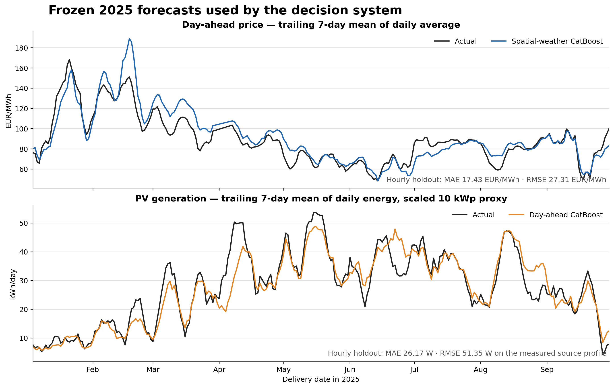

# Forecasting and Optimization for Industrial Energy Management

> First narrative draft. All reported forecasting and economic results use
> frozen 2024-to-2025 experiments. The deployment and monitoring section
> describes the implemented training layer and the intended operating model;
> it does not claim that a production platform has already been deployed.

## Executive summary

This project develops a small but complete decision system for an industrial
electricity consumer with flexible production load, on-site photovoltaic
generation and battery storage. The system must decide how to distribute
200 kWh of daily production over a 06:00--22:00 operating window, how to use a
44.16 kWh battery, how much electricity to nominate in the German day-ahead
market, and how to revise the physical schedule as new information becomes
available during the day.

The technical core combines point and probabilistic forecasting,
mixed-integer optimization, receding-horizon model-predictive control and
scenario-based stochastic optimization. The forecasting experiments include
gradient-boosted trees, persistence and autoregressive baselines, direct
residual correction, and MIMO models based on multilayer perceptrons and
LSTMs. Uncertainty is represented through joint residual bootstrap,
multi-quantile regression, empirical copulas and conformal calibration. The
decision experiments compare deterministic mixed-integer programming, sample
average approximation and mean-CVaR optimization. This breadth is deliberate:
the project tests an integrated decision workflow and the practical value of
advanced methods, rather than a single isolated model.

All model and policy choices are developed on 2024 data and then frozen. The
final evaluation uses 261 complete delivery days from January through
September 2025. Forecast metrics are reported as diagnostics, while the main
criterion is realised economic cost. Every policy is executed and settled
against the same factual PV generation, day-ahead prices, intraday-price proxy,
grid tariffs and battery-cost assumptions.

Two reference policies frame the economic comparison. The **Rule-based
strategy** is a performance floor: a common-sense schedule derived from
observed market dynamics, placing flexible load in historically cheaper hours
and battery discharge in historically expensive hours. It requires no machine
learning or mathematical optimization and could be implemented in a
spreadsheet. The **Day-ahead Oracle** is the performance ceiling and cost lower
bound. It allocates load, PV and battery capacity using factual PV generation
and factual day-ahead prices that would not be known when a real nomination is
submitted. The Oracle is still prevented from speculative intraday trading, so
its advantage comes only from perfect day-ahead information.

The resulting costs and the share of the Rule-to-Oracle opportunity captured
by each evaluated strategy are presented below.

| Strategy | Jan--Sep 2025 cost | Saving vs Rule | Opportunity captured |
|---|---:|---:|---:|
| Rule-based | EUR 7,992.53 | -- | 0.0% |
| Point day-ahead | EUR 7,547.38 | EUR 445.15 | 79.4% |
| Stochastic day-ahead, raw residual SAA | EUR 7,535.12 | EUR 457.41 | 81.6% |
| Point day-ahead + MPC | **EUR 7,484.07** | **EUR 508.46** | **90.7%** |
| Day-ahead Oracle | EUR 7,431.97 | EUR 560.56 | 100.0% |

**Figure 1.** Economic value relative to the common Rule-based policy. The
stochastic day-ahead and deterministic MPC results are separate experiments;
their gains must not be added.

The result should be read as evidence about the architecture and the relative
value of its components, rather than as a commercial savings claim. Access to
data was limited to public measurements, archived weather forecasts,
reanalysis and public market indices. The project has no on-site weather
station, plant telemetry, executable intraday quotes or order-book data. The
PV plant, battery and industrial demand form a synthetic scenario around a
real measured PV shape, and the economic replay covers nine months. Developing
state-of-the-art standalone forecasting models was therefore not the primary
goal: the models were kept deliberately compact so that the full path from
historical data to forecast, constrained decision and realised settlement
could be evaluated consistently.

## Motivation

The project began as a personal applied-research exercise: to combine data
science, forecasting, optimization and MLOps around one energy-management
problem. A parallel goal was to understand the structure of the German
electricity market and to represent its relevant operational and settlement
rules explicitly in the decision model.

The objective was not to reproduce a commercial energy-management platform or
to imply that a public-data simulation can determine an investment case. The
objective was to formulate the information boundary carefully, build the
decision chain end to end, compare strategies of increasing sophistication,
and identify where added complexity creates measurable value.

## 1. Business setting and decision chronology

The model represents an industrial prosumer in the DE-LU market area. The
production process requires 200 kWh during local hours 06:00--21:00. Each hour
must consume between 5 and 20 kWh, but the exact profile is flexible. A 10 kWp
PV proxy and two reference battery units can offset grid purchases or export
energy.

The decision process has two layers.

### Day-ahead decision

Before delivery, the system receives archived weather forecasts, historical
prices, the initial battery state and the production requirement. It predicts
PV generation and the next day's day-ahead price curve, then jointly selects:

- the hourly production-load profile;
- battery charge, discharge and state of charge;
- PV curtailment;
- the signed day-ahead market position.

The resulting position is fixed after the auction.

### Intraday MPC

Immediately before 06:00 and then once per hour, the controller observes the
executed load, battery state and completed PV and intraday-price observations.
It updates the PV and price forecasts, solves the remaining-horizon problem,
executes only the next action, and repeats. Past actions and the day-ahead
position cannot be changed.

The realised difference between physical grid exchange and the fixed
day-ahead position is settled at an hourly intraday continuous-price proxy.
Grid charges are applied to physical import, rather than to the financial
market deviation.

## 2. Data and reference scenario

The project combines measured, public and synthetic inputs.

| Component | Source and role | Main limitation |
|---|---|---|
| PV output | KIT MPVBench profile `1a`, 15-minute measurements, aggregated hourly | Exact panel coordinates and timestamp convention are not published |
| Weather fact | ERA5 reanalysis near Pforzheim, approximately 48.89 N, 8.70 E | Grid-cell reanalysis, not an on-site sensor |
| Weather forecasts | Archived DWD ICON forecasts; ten German locations for the price model | Fixed historical forecast products do not reproduce a live vendor feed exactly |
| Day-ahead prices | Public DE-LU auction history | Hourly products end after September 2025 in the working data contract |
| Intraday prices | Energy-Charts Intraday Continuous Average Price | Delivery-period average, not an executable quote or order book |
| Production load | Synthetic flexible demand | No real plant process or ramp constraints |
| Battery and tariff | Reference equipment and Pforzheim 2025 variable tariff | Engineering and contract assumptions, not site telemetry or an offered supply contract |

The common UTC intersection of actual weather, archived weather forecasts and
day-ahead prices covers 17,543 hourly timestamps in 2024--2025. MPVBench
contains 70,176 fifteen-minute records across five profiles. Profile `1a` is
used because it has the cleanest coverage; three dates with simultaneous zero
production across several profiles are treated as data outages.

The PV series provides a real production *shape*. It is scaled by a factor of
20 from the roughly 0.5 kW source profile to a 10 kWp modelling asset. The
working timezone assumption is `Europe/Berlin`, supported by the observed
solar-day alignment but not confirmed by source metadata.

The fixed physical scenario is:

| Parameter | Value |
|---|---:|
| Daily production energy | 200 kWh |
| Operating window | 06:00--22:00, 16 delivery hours |
| Hourly production bounds | 5--20 kWh |
| PV proxy | 10 kWp |
| Battery usable capacity and initial SoC | 44.16 kWh |
| Maximum charge and discharge | 5 kWh per hour |
| Charge/discharge efficiency | 98% / 98% |
| Degradation cost | EUR 0.05 per discharged kWh |
| Daytime variable import tariff | EUR 0.10181 per kWh |
| Nighttime variable import tariff | EUR 0.07441 per kWh |

Fixed daily network charges are excluded from dispatch and pairwise strategy
comparisons because they are identical for every policy. They can be added to
an absolute customer bill without changing any decision or relative saving.

## 3. Mathematical decision model

### 3.1 Notation

Let the operating hours be

$$
\mathcal H=\{6,7,\ldots,21\}.
$$

For hour \(h\), let \(L_h\) be production consumption, \(G_h\) available PV,
\(U_h\) curtailed PV, \(C_h\) battery charge, \(D_h\) battery discharge and
\(E_h\) state of charge. The signed physical grid exchange is

$$
g_h=L_h+C_h-(G_h-U_h)-D_h.
$$

Positive \(g_h\) is import and negative \(g_h\) is export. Its linear split is

$$
I_h\ge g_h,\qquad I_h\ge0,
$$

$$
X_h\ge-g_h,\qquad X_h\ge0.
$$

Here \(q_h^{DA}\) is the signed day-ahead nomination and

$$
\Delta_h=g_h-q_h^{DA}
$$

is the realised intraday deviation.

### 3.2 Flexible production load

The process must complete its daily energy requirement while respecting hourly
bounds:

$$
\sum_{h\in\mathcal H}L_h=200,
$$

$$
5\le L_h\le20\qquad\forall h\in\mathcal H.
$$

This is intentionally an energy-allocation model. Start-up costs, product
deadlines, ramping and machine-level constraints are outside the V1 scope.

### 3.3 PV and curtailment

PV may be consumed, stored, exported or curtailed:

$$
0\le U_h\le G_h.
$$

Curtailment prevents the optimizer from treating export during sufficiently
negative prices as mandatory. In execution, the optimized curtailment fraction
is applied to factual PV so that forecast error cannot create infeasible
negative generation.

### 3.4 Battery dynamics

For charge efficiency \(\eta_c\) and discharge efficiency \(\eta_d\),

$$
E_{h+1}=E_h+\eta_c C_h-\frac{D_h}{\eta_d},
$$

$$
0\le E_h\le E^{\max},\qquad E^{\max}=44.16.
$$

Charge and discharge are capped at 5 kWh per hour. A binary operating mode
prevents simultaneous charging and discharging:

$$
0\le C_h\le5z_h,
$$

$$
0\le D_h\le5(1-z_h),\qquad z_h\in\{0,1\}.
$$

The model can charge during the working day when wholesale price, grid tariff,
PV opportunity cost and terminal battery value make it economic. This includes
negative-price periods and low-price PV surplus.

Overnight charging is not represented as a separate hourly optimization
problem. Instead, each operating day starts with a full battery, and any
closing SoC shortfall is converted into a terminal recharge liability using a
causal proxy for the expected overnight charging price:

$$
C_T=\frac{E^{\max}-E_T}{\eta_c}
\left(\frac{\max(\bar P^{night},0)}{1000}+t^{night}\right).
$$

The causal night-price benchmark \(\bar P^{night}\) is the rolling mean of the
latest 14 completed nights. Each night covers price labels 22:00, 23:00 and
00:00--06:00. Negative nightly means are floored at zero before aggregation.

### 3.5 Settlement ledger

Let \(P_h^{DA}\) and \(P_h^{ID}\) be realised prices in EUR/MWh, \(t_h^{imp}\)
the variable physical-import tariff, \(t^{exp}\) the export charge and
\(c^{deg}\) battery degradation cost. Realised daily cost is

$$
\begin{aligned}
C_{day}={}&
\sum_h\frac{P_h^{DA}}{1000}q_h^{DA}
+\sum_h\frac{P_h^{ID}}{1000}\Delta_h\\
&+\sum_h t_h^{imp}I_h
+\sum_h t^{exp}X_h
+c^{deg}\sum_hD_h
+C_T.
\end{aligned}
$$

The ledger separates the financial market position from physical grid use.
This avoids charging network fees on a purely financial deviation and supports
exact reconciliation of every strategy.

### 3.6 Deterministic day-ahead optimization

The deterministic optimizer replaces future PV and prices by point forecasts
\(\widehat G_h\) and \(\widehat P_h^{DA}\), solves the physical schedule and
sets

$$
q_h^{DA}=L_h+C_h-(\widehat G_h-U_h)-D_h.
$$

The decision variables are the hourly load, charge, discharge, curtailment,
SoC, battery mode and physical import/export variables. The optimizer minimizes
forecasted day-ahead energy cost, physical grid charges, battery degradation
and terminal recharge liability:

$$
\min_{L,C,D,U,E,z,I,X}
\left[
\sum_{h\in\mathcal H}
\left(
\frac{\widehat P_h^{DA}}{1000}q_h^{DA}
+t_h^{imp}I_h+t^{exp}X_h+c^{deg}D_h
\right)
+C_T
\right].
$$

The binary battery-mode variable \(z_h\) makes this a mixed-integer linear
program rather than a continuous linear program. It is required to enforce the
discrete choice between charging and discharging in each hour.

The schedule is therefore balanced under the information available before the
auction. Forecast error creates a deviation only when the day is executed.

### 3.7 Shrinking-horizon MPC

At decision time \(\tau\), all actions before \(\tau\), current SoC and the
completed portion of the 200 kWh requirement are fixed. The controller solves
the same model over

$$
\mathcal H_\tau=\{\tau,\tau+1,\ldots,21\},
$$

subject to the remaining-load constraint

$$
\sum_{h\in\mathcal H_\tau}L_h
=200-\sum_{h<\tau}L_h^{actual}.
$$

The day-ahead position \(q_h^{DA}\) remains fixed. Load, charge, discharge,
curtailment and SoC are reoptimized. Only the first action is executed before
the horizon shrinks and the problem is solved again.

At time \(\tau\), the MPC decision variables are the same physical variables
as in the day-ahead problem, restricted to the remaining horizon. The incurred
day-ahead purchase is already fixed and is therefore a constant in this
optimization. MPC minimizes the forecasted cost of the remaining intraday
deviations, physical grid use, battery degradation and terminal recharge:

$$
\min_{L,C,D,U,E,z,I,X}
\left[
\sum_{h\in\mathcal H_\tau}
\left(
\frac{\widehat P_{h\mid\tau}^{ID}}{1000}
\left(g_{h\mid\tau}-q_h^{DA}\right)
+t_h^{imp}I_h+t^{exp}X_h+c^{deg}D_h
\right)
+C_T
\right].
$$

The next-hour intraday-price forecast uses the learned spread correction; more
distant hours retain the known day-ahead curve. The forecast grid exchange
\(g_{h\mid\tau}\) uses the latest PV forecast and current factual battery
state.

### 3.8 Stochastic day-ahead optimization

The stochastic extension generates \(S=500\) joint daily scenarios for PV,
day-ahead price and the intraday-minus-day-ahead spread. Two scenario-generation
approaches were implemented and compared.

The intraday spread is needed even though the decision is made day-ahead.
Errors in the PV forecast cause the realised physical exchange to differ from
the submitted day-ahead position, and that deviation is settled at the future
intraday price,

$$
P_{s,h}^{ID}=P_{s,h}^{DA}+S_{s,h}.
$$

The spread scenarios therefore value forecast-induced imbalance risk; they do
not permit the optimizer to take a speculative intraday position. If the model
instead assumed \(P_h^{ID}=P_h^{DA}\) in every scenario, a separate spread
forecast would not be required.

1. **Joint residual bootstrap.** Rolling-origin 2024 forecast errors are stored
   as complete daily trajectories. One sampled historical day supplies the PV,
   day-ahead-price and spread residual paths together, preserving cross-hour
   and cross-target dependence. Raw, centered and seasonally weighted variants
   were evaluated.
2. **Multi-quantile regression with an empirical copula.** Separate conditional
   quantile models estimate the marginal predictive distributions. Historical
   rank vectors form an empirical copula that reconnects the marginals into
   coherent multivariate daily scenarios. Conformal calibration was evaluated
   as an additional coverage correction.

Both generators feed the same stochastic optimizer, which separates the value
of scenario construction from the value of the optimization formulation.

The physical decisions are shared across scenarios. To prevent deliberate
day-ahead/intraday speculation, the nomination remains tied to the frozen
point PV forecast. Scenario uncertainty changes the settlement deviation, not
the commercial interpretation of the nomination.

Sample-average approximation solves

$$
\min_x\frac{1}{S}\sum_{s=1}^{S}C_s(x).
$$

The risk-averse extension adds empirical CVaR:

$$
\min_{x,\zeta,\xi_s}
\left[
\frac{1}{S}\sum_sC_s(x)
+\lambda\left(
\zeta+\frac{1}{(1-\alpha)S}\sum_s\xi_s
\right)
\right],
$$

subject to

$$
\xi_s\ge C_s(x)-\zeta,\qquad \xi_s\ge0,
$$

with \(\alpha=0.95\). Stochastic MPC is deliberately excluded: it would require
hundreds of scenario optimizations at every hourly control step, while the
deterministic MPC already leaves a small residual opportunity.

### 3.9 Rule-based and Oracle boundaries

The Rule-based policy uses an average historical price shape to place high
load in cheap hours and battery discharge in expensive hours. Its day-ahead
purchase covers the production profile. Factual PV can refill battery headroom,
serve load or be exported; residual PV is curtailed under negative prices.

The Oracle knows factual PV and factual day-ahead prices before nomination. It
does not know or trade against future intraday prices. Its nomination equals
its physical schedule,

$$
q_h^{DA}=g_h,
$$

so \(\Delta_h=0\). This defines a useful lower cost bound without giving the
benchmark an artificial speculative business model.

## 4. Forecasting and uncertainty models

The point models are deliberately compact. The project aims to test an entire
decision system, rather than to win a forecasting benchmark through extensive
model search.

| Decision input | Final point model | Frozen 2025 result |
|---|---|---:|
| Day-ahead PV | CatBoost with calendar, solar geometry and archived weather | MAE 26.17 W, RMSE 51.35 W; nMAE 5.32% of 2024 observed peak |
| Intraday PV | Direct CatBoost residual correction | MAE 16.41 W vs 17.44 W frozen-head baseline on MPC pairs |
| Day-ahead price | CatBoost with price history, calendar and spatial German weather | MAE 17.43 EUR/MWh, RMSE 27.31 EUR/MWh, daily Spearman 0.912 |
| Next-hour intraday price | Regularized CatBoost on intraday-minus-day-ahead spread, shrunk 70% | MAE 12.67 vs 12.79 EUR/MWh for the known day-ahead curve |

**Figure 2.** Frozen forecasts against 2025 facts. The lines are trailing
seven-day summaries for readability; reported metrics are calculated on
hourly observations.

### 4.1 PV model comparison

The intraday PV experiment compares a frozen day-ahead forecast, latest-error
persistence, direct CatBoost residual correction, a MIMO multilayer perceptron
and a MIMO LSTM. Every model is evaluated on the same 17,034
`(decision time, future target hour)` pairs.

| Intraday PV method | MAE, W | RMSE, W | MAE change vs frozen day-ahead |
|---|---:|---:|---:|
| Frozen day-ahead forecast | 17.44 | 33.15 | -- |
| Latest-residual persistence | 44.65 | 68.59 | 156.0% worse |
| Direct residual CatBoost | **16.41** | **31.70** | **5.9% better** |
| MIMO MLP | 17.28 | 33.11 | 0.9% better |
| MIMO LSTM | 17.08 | 33.73 | 2.1% better |

The difference between CatBoost and the neural trajectory models is modest,
but CatBoost is both the most accurate and the simplest model to train, serve
and explain. More data-intensive sequence architectures, including temporal
transformers such as TFT, Informer or PatchTST, were considered but not pursued.
With only one year of single-site training history, a reliable comparison would
be difficult and added model capacity would be more likely to increase
variance than to improve the decision system.

### 4.2 Price model comparison

The day-ahead price experiment moves from a simple previous-day persistence
baseline to price-history CatBoost, then adds local and spatial weather
forecasts.

| Day-ahead price method | MAE, EUR/MWh | RMSE, EUR/MWh | Mean daily Spearman |
|---|---:|---:|---:|
| Previous-day same-hour persistence | 25.57 | 40.12 | 0.796 |
| Price history + calendar | 20.36 | 30.95 | 0.876 |
| Price history + local weather | 19.33 | 30.06 | 0.878 |
| Price history + spatial German weather | **17.43** | **27.31** | **0.912** |

For intraday prices, the already-cleared day-ahead curve remains the strongest
baseline. The tested alternatives include last-price persistence, direct
CatBoost prediction of the intraday-minus-day-ahead spread, richer rolling
statistics, a local AR(1) feature, and updated local and spatial weather. The
selected hybrid applies a shrunk CatBoost spread correction only to the next
delivery hour and retains the day-ahead curve beyond it. The full-horizon MAE
improves only from approximately 12.8 to 12.6 EUR/MWh; applying the correction
to every remaining hour is worse. The final design therefore keeps the small,
stable correction rather than the most elaborate feature set.

### 4.3 Probabilistic forecasting and scenario generation

The project evaluates conditional quantile regression and residual-based
scenario generation, rather than treating uncertainty as a fixed Gaussian
error around the point forecast.

| Approach | Construction | Observed role in the project |
|---|---|---|
| MultiQuantile CatBoost | Jointly estimates nine conditional quantiles from P05 to P95 for every target and hour | Flexible marginal distributions, but raw price and spread intervals are underdispersed |
| Empirical copula | Samples historical 48-dimensional rank vectors covering PV generation, day-ahead price and the intraday-minus-day-ahead price spread over sixteen hours | Restores cross-hour and cross-target dependence to separately estimated marginals |
| Conformalized quantile regression | Expands quantile intervals using rolling-origin 2024 nonconformity scores | Repairs coverage, but produces conservative intervals and no superior economic policy |
| Joint residual bootstrap | Samples complete rolling-origin daily residual trajectories for PV, day-ahead price and spread | Simpler dependence model and the best realised stochastic economic result |
| Seasonal residual bootstrap | Reweights residual days by circular calendar distance and rescales PV errors locally | Useful conditional sensitivity check, without a material economic gain |

For the raw quantile model, P10--P90 coverage is 72.7% for PV, 41.2% for
day-ahead price and 55.0% for intraday spread, compared with a nominal 80%.
Conformal calibration raises those values to 90.9%, 87.1% and 87.7%,
respectively. It solves undercoverage but overshoots the target and widens the
market-price intervals substantially. The empirical-copula workflow is
therefore technically valid and demonstrates conditional probabilistic
forecasting, but its scenarios do not outperform the simpler residual
bootstrap in the final economic replay.

The seasonal bootstrap was introduced to avoid drawing a winter residual day
for a summer forecast with the same probability as a nearby calendar day. For
target date \(d\), historical residual day \(j\) receives weight

$$
w_j(d)=(1-\rho)
\frac{\exp\left[-\Delta_{circ}(d,j)^2/(2b^2)\right]}
{\sum_k\exp\left[-\Delta_{circ}(d,k)^2/(2b^2)\right]}
+\rho\frac{1}{N},
$$

where \(\Delta_{circ}\) is circular day-of-year distance, \(b=25\) days and
\(\rho=0.15\). The 15% uniform mixture prevents rare residual regimes from
disappearing completely. One selected day still supplies the complete paired
PV, day-ahead-price and spread trajectory. PV residuals are standardized by
local hour-specific scale before being mapped to the target day's forecast
scale.

This conditioning reduces the mean effective residual library from 210 to
64.8 days. It brings day-ahead-price P10--P90 coverage to 80.4%, but does not
improve PV CRPS and worsens spread CRPS. Seasonal SAA saves EUR 8.81 relative
to deterministic day-ahead, compared with EUR 12.26 for raw uniform residual
SAA. On the May--September period with adequate seasonal support, seasonal and
centered uniform sampling save EUR 3.76 and EUR 3.74 respectively. The seasonal
kernel is therefore retained as a robustness check, not as the selected
scenario generator.

## 5. Evaluation design

The evaluation follows a strict temporal contract:

- all model development and fitting use 2024 data;
- fixed configurations are refitted on all eligible 2024 observations;
- January--September 2025 is read once as a future holdout;
- no 2025 target is used in feature scaling, model selection or scenario
  construction;
- rolling-origin predictions create the 2024 residual library used by the
  stochastic generator;
- all economic policies use the same 261 complete delivery days and the same
  factual settlement ledger.

The price evaluation ends on 30 September because the working day-ahead source
changes from hourly to 15-minute products on 1 October 2025. Quarter-hour
prices are not averaged into a synthetic hourly contract.

Forecast metrics are supporting diagnostics. The primary selection criterion
is realised out-of-sample economic cost. Economic differences for stochastic
policies are accompanied by moving-block bootstrap intervals, preserving some
serial dependence between neighbouring delivery days.

Repeated experiments against the same 2025 period create a real risk of
researcher overfitting. Results are therefore interpreted as project evidence,
not as a final unbiased estimate for a commercial deployment.

## 6. Economic results and interpretation

### 6.1 Deterministic decision stack

Point day-ahead optimization saves EUR 445.15 relative to Rule-based and leaves
EUR 115.41 of the Rule-to-Oracle opportunity unresolved. MPC adds EUR 63.31,
closing 54.9% of that remaining gap. The combined deterministic system ends
only EUR 52.10 above Oracle.

This is a stronger result than the forecast metrics alone suggest. The direct
PV residual correction improves trajectory MAE by only 5.9%, and the
next-hour intraday-price correction is also small. MPC still creates material
value because it repeatedly reallocates the remaining production requirement
and battery energy after forecast errors have become observable.

### 6.2 Stochastic day-ahead optimization

Raw joint-residual SAA costs EUR 7,535.12 and saves EUR 12.26 relative to the
point day-ahead policy. Its 95% moving-block bootstrap interval is
[EUR 6.12, EUR 19.47], so the mean-cost improvement is supported within this
replay. It closes 10.6% of the remaining Point-to-Oracle gap.

The gain is useful but modest. Centering residuals reduces the saving to
EUR 10.71. A seasonal conditional bootstrap saves EUR 8.81 over the full
period and is nearly indistinguishable from centered uniform sampling on the
seasonally well-supported May--September subset.

Adding CVaR penalties does not establish a reliable reduction in realised
CVaR95. Large weights make the schedule more conservative and increase total
cost. The selected stochastic strategy is therefore risk-neutral SAA rather
than a mean-CVaR policy.

### 6.3 Physical audit

Every final strategy satisfies the same physical checks:

- exactly 200 kWh of production is completed on every retained day;
- SoC stays inside 0--44.16 kWh;
- charge and discharge never overlap;
- curtailment remains between zero and factual PV;
- the Oracle has zero intraday deviation;
- hourly energy balance and daily cost components reconcile numerically.

Battery use changes materially with policy. Rule-based performs 49.4 equivalent
full cycles over the replay, point day-ahead 142.4, deterministic MPC 136.8
and Oracle 144.2. Degradation and overnight restoration are included, so the
optimizer does not treat battery energy as free.

## 7. Software and operating model

The implementation is a modular Python package rather than a collection of
model-specific services. Data contracts, feature builders, training
applications, scenario generators, optimizers and backtests share one codebase
and one set of units and temporal conventions.

Implemented components include:

- reproducible historical-data and feature-building commands;
- packaged training applications for day-ahead PV, MPC PV and intraday price,
  plus a reproducible day-ahead-price experiment;
- seasonal week and chronological split utilities;
- MLflow logging and optional Model Registry version creation;
- deterministic, MPC, SAA and CVaR decision cores;
- common replay and settlement ledgers;
- saved configurations, predictions, feature importance and audit artifacts;
- automated tests for physical constraints, temporal contracts and scenario
  generation.

The intended deployment remains a modular monolith: one application image,
four independently versioned model artifacts, scheduled batch decisions and a
small API boundary. ClearML can orchestrate ingestion, feature, training and
backtest tasks; MLflow remains the source of truth for experiment tracking and
model versions.

Serving, Docker packaging, ClearML pipelines, dashboards, alerting and
automatic champion/fallback switching are still to be implemented. They are
the appropriate next phase because the modelling and decision contracts are
now stable enough to monitor.

## 8. Limitations

The most important limitations are structural:

1. **Synthetic industrial system.** Load flexibility, PV scale and battery
   capacity are scenario assumptions rather than one site's telemetry.
2. **Location uncertainty.** Weather uses an approximate Pforzheim coordinate,
   and the PV timestamp convention remains provisional.
3. **Market proxy.** Intraday continuous average is a settlement proxy, not an
   executable quote available at the control instant.
4. **Simplified production process.** The model has hourly energy bounds but no
   machine states, ramps, batches, labour constraints or product deadlines.
5. **Limited history.** One training year restricts neural models, tail
   estimation and seasonal residual sampling.
6. **Incomplete customer bill.** Variable grid charges are represented, while
   supplier risk premiums, balancing responsibility, demand charges and
   contract-specific fixed fees are outside the optimized ledger.
7. **Single repeatedly inspected holdout.** January--September 2025 is temporal
   out-of-sample data, but it has been used for several project-level
   comparisons.

These limitations do not invalidate the architecture experiment. They limit
the interpretation of the absolute euro values and prevent the result from
being treated as an investment recommendation.

## 9. Conclusion

The project demonstrates an end-to-end forecasting and optimization workflow
in which models are evaluated through the decisions they support. The strongest
result is the deterministic stack: point day-ahead optimization captures most
of the available value, and MPC recovers more than half of the remaining gap.

Probabilistic forecasting and stochastic optimization add a smaller but
measurable mean-cost improvement. Their main contribution is methodological:
they expose uncertainty explicitly, preserve joint temporal dependence and
allow the cost of risk aversion to be tested. The experiments also show when
that sophistication is not useful: CVaR penalties and more elaborate scenario
models do not automatically improve realised economics.

The modelling phase is sufficiently complete for the next work to focus on
operability: packaging the decision application, scheduling it, monitoring
data and model drift, comparing predicted and realised economics, and safely
switching between champion models and robust fallbacks.

## Supporting project documents

- [Frozen 2024-to-2025 forecast evaluation](temporal_backtest_2025.md)
- [Final deterministic economic formulation](economic_backtest_v4_final_formulation.md)
- [Residual-bootstrap stochastic backtest](residual_bootstrap_spread_economic_backtest_v3.md)
- [Technical architecture draft](technical_architecture_draft.md)
- [Data-quality report](data_quality_report.md)
