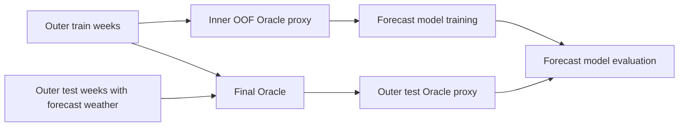

# PV model data and fold contract

This note describes the data and split utilities for your PV modelling work. It does not prescribe a model family, feature-selection policy, hyperparameter search or final forecasting design.

## Purpose of the two data views

The project contains two conceptually different views of the same hourly PV target.

| View | What it represents | Weather available to it | Intended use |
|---|---|---|---|
| Oracle | an offline upper-bound relationship between PV and realised weather | actual ERA5 weather | understand the physical weather-to-PV relationship |
| Day-ahead forecast | the model available before delivery | archived ICON forecast weather | predict PV for the delivery hour |

Both views predict the same target: `pv_power_mean_w`, the mean PV power in watts for a delivery hour. `pv_energy_kwh` is the corresponding hourly energy target if you prefer to model energy directly.

The Oracle is never a deployable source of actual weather. Its role is diagnostic: it tells you how much of the target could be explained if weather were known perfectly.

## Input tables

### Day-ahead PV table

Use [day_ahead_pv_2024.parquet](../data/features/day_ahead_pv/day_ahead_pv_2024.parquet) as the starting table for the real forecast model. It has 8,277 usable hourly rows for 2024.

It contains:

- targets: `pv_power_mean_w`, `pv_energy_kwh`;
- weather forecast fields: `weather_forecast_<variable>`;
- context: `hour_sin`, `hour_cos`, `day_of_year_sin`, `day_of_year_cos`, `is_weekend`, `horizon_hours`;
- time identity: `valid_time_utc`, `valid_time_local`, `delivery_date_local`;
- split metadata: `week_index`.

The weather variables are:

```text
temperature_2m
shortwave_radiation
direct_radiation
diffuse_radiation
wind_speed_10m
cloud_cover
```

`week_index` is a split identifier only. It must not be included in `X` when fitting a model.

### Oracle PV table

Use [oracle_pv_2024.parquet](../data/features/oracle_pv/oracle_pv_2024.parquet) for the Oracle. It contains exactly the same target rows and `week_index` as the day-ahead PV table, but replaces forecast weather with actual weather. Actual weather is intentionally absent from the day-ahead table because it would be leakage for a deployable forecast.

```text
weather_actual_temperature_2m
weather_actual_shortwave_radiation
weather_actual_direct_radiation
weather_actual_diffuse_radiation
weather_actual_wind_speed_10m
weather_actual_cloud_cover
```

The ready helper combines the two explicit tables when you need both weather variants in one frame:

```python
from energy.modeling import load_pv_model_frame

frame = load_pv_model_frame(".", year=2024)
```

It returns the day-ahead rows plus actual-weather columns, filters incomplete rows and keeps the original `week_index`.

## Five-fold weekly split

There are 51 usable local calendar weeks, numbered `0` through `50`. The two early January weeks are absent because archived forecast weather starts later in January.

`SeasonalWeekKFold(n_splits=5, random_state=42)` assigns complete weeks to five folds. A week is never divided between training and test. The assignment is performed separately within winter, spring, summer and autumn, then rotated so the outer folds have similar sizes. Every test fold contains all seasons.

```python
from energy.data import SeasonalWeekKFold

folds = SeasonalWeekKFold(n_splits=5, random_state=42)
for train_indices, test_indices in folds.split(frame):
    train = frame.iloc[train_indices]
    test = frame.iloc[test_indices]
```

The output indices are positional and can be used with `.iloc`. `split_with_metadata(frame)` additionally provides the fold number and the exact train/test week identifiers.

This is a development cross-validation split: it allows every fold to contain every season. It is not the final simulation of deployment through time. The final economic evaluation should hold out 2025 chronologically.

## Correct out-of-fold Oracle proxy

If you decide to use an Oracle prediction as a feature for the real forecast model, the proxy must be generated out-of-fold.

For one outer test fold $F$:

1. Set the other four folds aside as `outer_train`.
2. Split `outer_train` again into inner folds.
3. For each inner validation fold, fit the Oracle on the other inner folds using actual weather and predict that held-out inner fold using forecast weather. These predictions form the Oracle proxy for `outer_train`.
4. Fit a final Oracle on all `outer_train` rows using actual weather. Apply it to the forecast-weather fields of $F$ to obtain the Oracle proxy for the outer test fold.
5. Fit your real forecast model on `outer_train` with forecast-weather features and the inner out-of-fold proxy. Evaluate it on $F$ with the final-Oracle proxy.

This rule matters because an in-sample Oracle prediction can encode the target too closely. The downstream model would then look stronger in validation than it really is.



## Existing utility functions

| Function or class | Responsibility | Model-independent? |
|---|---|---|
| `add_week_index(frame)` | adds consecutive local-calendar week IDs | yes |
| `SeasonalWeekSplitter` | one 70/15/15 development split | yes |
| `SeasonalWeekKFold` | season-balanced K-fold split by full weeks | yes |
| `load_pv_model_frame(project_root, year)` | joins actual weather to day-ahead PV rows | yes |
| `CrossFittedPVExperiment` | reference implementation of the nested procedure | no; optional example |

You can use the first four utilities with any estimator, including a custom PyTorch, LightGBM or scikit-learn model. The reference `CrossFittedPVExperiment` is left in the project as an executable example, but it is not a constraint on your modelling work.

## Direct residual data contract for MPC

The MPC residual model is a second, pointwise PV model. It corrects rather
than replaces a frozen day-ahead forecast. For a future delivery hour `t`:

```text
residual[t] = actual_pv[t] - day_ahead_prediction[t]
corrected_pv[t] = max(day_ahead_prediction[t] + predicted_residual[t], 0)
```

One offline training row represents a pair of local times:

```text
(decision hour tau, future target hour t), where t > tau
```

The following values may enter the feature vector:

| Feature group | Availability rule |
|---|---|
| Target-hour forecast weather and solar geometry | available at the original day-ahead decision time in V1 |
| `day_ahead_prediction_w` for target hour | frozen before the delivery day; never recomputed from factual PV |
| Up to `N_LAGS` historical PV values | only completed solar-active hours strictly before `tau` |
| Corresponding historical day-ahead forecasts and residuals | derived from those frozen forecasts and factual PV measurements |
| Decision hour and remaining horizon | derived from `tau` and target time |

The implementation uses a dynamic solar-active interval rather than a fixed
clock interval: clear-sky GHI at the Pforzheim proxy coordinate must be at
least 25 W/m². At the beginning of a solar day, unavailable lag values are
`NaN` and each has an availability flag. `week_index` still remains split
metadata, never a model feature.

### Leakage-safe two-stage evaluation

Residual training needs realistic historical day-ahead errors. In-sample
day-ahead predictions would be too accurate and would hide the residual signal.
For every outer test fold, the procedure is therefore:

1. Generate out-of-fold day-ahead predictions inside outer training weeks.
2. Fit a day-ahead model on all outer-training weeks and predict the outer-test
   weeks.
3. Construct residual MPC rows separately for outer training and outer test.
4. Fit the residual model on outer-training rows and evaluate it only on the
   outer-test decision / target pairs.

The evaluation compares the same pairs for three strategies: frozen day-ahead
baseline, latest-residual persistence, and CatBoost direct residual correction.
This metric is an MPC-trajectory metric, not the ordinary day-ahead MAE: a
physical target hour can appear in several rows because it is reforecast from
several earlier decision times.

See `docs/pv_mpc_residual_training.md` for the CLI command, MLflow artefacts
and Model Registry contract.

## Practical checks before training

- Do not use `week_index`, `valid_time_utc`, `target_available_at_utc`, or any actual-weather field in the deployable forecast feature matrix.
- Do not fit an Oracle on a fold and then use its predictions from that same fold as training features for the forecast model.
- Clip predicted PV power at zero before reporting or passing it to the optimizer.
- Report all-hour MAE/RMSE and a daylight or active-generation metric; all-hour metrics include many nighttime zero values.
- For the MPC residual model, retain the day-ahead forecast used to form every
  historical residual and use only factual production measurements that were
  complete before each simulated decision hour.
